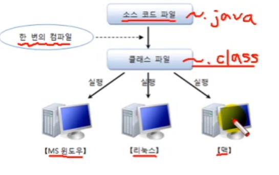

# 자바의 특징

## 이식성이 높은 언어이다.

- 윈도우에서 설치한 프로그램은 다른 OS에서 실행할 수 없다.
- 윈도우에서 자바 코드를 컴파일 하여 복사한 뒤 다른 OS에서 실행 해도 아무 문제가 없다.
- 따라서 자바는 이식성이 높은 언어이다.

- 윈도우에서 사용하기 위해 윈도우용 컴파일러를 실행하는 것이 아니다.
- 마찬가지로 리눅스에서 사용하기 위해 리눅스용 컴파일러를 실행하는 것도 아니다.
- 윈도우에서 한 번 컴파일하고 복사하여 리눅스, 맥에서 사용 할 수 있다.

## 객체 지향 언어이다.

## 막강한 오픈소스 라이브러리가 풍부하다.
- 자바는 오픈 소스 언어이므로 자바로 개발된 라이브러리도 오픈 소스가 많다.
- 노력과 시간 비용을 줄이고, 유지 보수의 편리성을 위해 사용할 수 있다.

