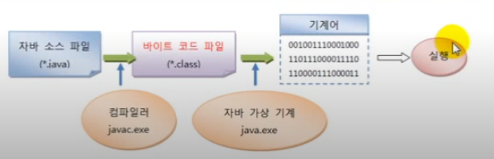

# 소스 작성에서부터 실행까지

자바 프로그램을 개발하려면 다음과 같은 순서로 진행해야 한다.

.java 소스 파일 작성 -> 컴파일러(javac.exe)로 바이트 코드 파일(.class) 생성
-> JVM 구동 명령어(java.exe)로 실행

자바 프로그램을 개발하기 위해서는 우선 파일 확장명이 .java인 텍스트 파일을
생성하고 프로그램 소스를 작성한다. 이렇게 만들어진 파일을 자바 소스 파일이라고
한다. 작성 완료된 소스 파일은 컴파일러(javac.exe)로 컴파일해야 한다.
컴파일이 성공되면 확장명이 .class인 바이트 코드 파일이 생성된다.
예를 들어, 명령 프롬프트에서 Hello.java 소스 파일을 다음과 같이
컴파일하면 Hello.class 파일이 생성된다.

```java
javac Hello.java
```
바이트 코드 파일은 완전한 기계어가 아니므로 단독으로 실행할 수 없고
JVM이 실행되어야 한다.

JVM을 구동시키는 명령어는 java.exe이다. 예를 들어 
Hello.class 라는 바이트 코드 파일을 java.exe로 실행하려면 
명령 프롬프트에서 다음과 같이 입력하고 `Enter`키를 누르면 된다.
주의할 점은 java.exe로 바이트 코드 파일을 실행할 때는 .class 확장명을
제외한 이름을 입력해야 한다.
```java
java Hello
```

java.exe 명령어가 실행되면 JVM은 바이트 코드 파일(Hello.class)을
메모리로 로드하고, 최적의 기계어로 번역한다. 그리고 main() 메소드를
찾아 실행시킨다. 자바 소스 작성에서 부터 실행까지의 과정을 도식화하면 다음과
같다.

