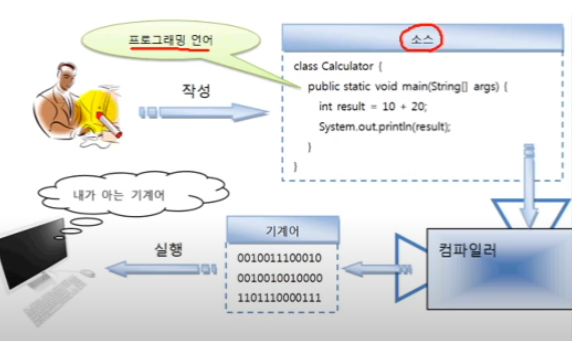

# 프로그래밍 언어란?

컴퓨터가 이해할 수 있는 언어는 우리가 일상생활에서 사용하는 언어와는 너무나도
다른 기계어다. 기계어는 0과1로 이루어진 이진 코드이기 때문에 
사람이 이해하기에는 매우 어렵다. 반면 사람이 사용하는 언어는 컴퓨터
입자에서 보면 이해할 수 없는 문자 집합이다. 그렇기 때문에 사람과 컴퓨터가
대화하기 위해서는 사람의 언어와 기계어의 다리 역할을 하는 프로그래밍 언어가
필요하다.

프로그래밍 언어는 고급 언어와 저급 언어로 구분된다. 고급 언어란 컴퓨터와 대화
할 수 있도록 만든 언어 중에서 사람이 쉽게 이해할 수 있는 언어를 말한다.
고급 언어로 작성된 소스는 컴퓨터가 바로 이해할 수 없기 때문에
컴파일(compile) 과정을 통해서 컴퓨터가 이해할 수 있는 0과 1로 이루어진 
기계어로 변환한 후 컴퓨터가 사용하게 된다. 반대로 저급 언어란 기계어에
가까운 언어를 말하는데, 대표적으로 어셈블리어가 저급 언어에 속한다.
저급 언어는 사람이 쉽게 이해 할 수 없기 때문에 배우기가 매우 까다롭다.

일반적으로 프로그래밍 언어라고 하면 고급 언어를 말하는데, 대표적인 프로그래밍
언어인 C, C++ , 자바(java)는 모두 고급 언어에 속한다.
이 언어들로 작성된 내용을 소스(source)라고 부르고, 이 소스는 컴파일러
(compiler)라는 소프트웨어에 의해 기계어로 변환된 후 컴퓨터에서 실행할 수 있게
된다. 우리가 흔히 말하는 프로그램(program)이란 컴퓨터에서 특정 목적을
수행하기 위해 프로그래밍 언어로 작성된 소스를 기계어로 번역하는 것을 말한다.

