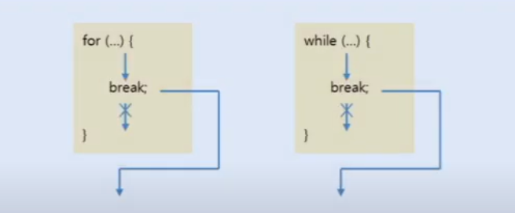
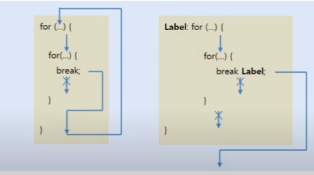

# break 문

break문은 반복문인 for문 , while문 , do-while문을 실행 중지
할 때 사용된다. 또한 이전에 학습한 switch문에서도 break문을 사용하여
switch문을 종료한다. 다음은 반복문에서 break문을 사용할 때의 실행 흐름을
보여준다.



break문은 대개 if문과 같이 사용되어 if문의 조건식에 따라 for문과
while문을 종료 할 때 사용한다. 
다음 예제는 while문을 이용해서 주사위 번호 중 하나를 반복적으로 뽑되,
6이 나오면 while문을 종료 시킨다.

`BreakExample.java`  break로 while 종료

```java

public class BreakExample {
    public static void main(String[] args) {
        while (true){
            int num = (int)(Math.random()*6)+1;
            System.out.println(num);
            if (num ==6) break;
        }
        System.out.println("프로그램 종료");
    }
}

```
만약 반복문이 중첩되어 있을 경우 break문은 가장 가까운 반복문만 종료하고
바깥쪽 반복문은 종료시키지 않는다. 중첩된 반복문에서 바깥쪽 반복문까지
종료시키려면 바깥쪽 반복문에 이름(라벨)을 붙이고, "break 이름;"을 
사용하면 된다. 



다음 예제를 보면 바깥쪽 for문은 'A'~'Z'까지 반복하고, 
증첩된 for문은 'a'~'z'까지 반복하는데, 중첩된 for문에서 
lower 변수가 'g'를 갖게 되면 바깥쪽 for문까지 빠져나오도록 했다.

`BreakOutterExample.java` 바깥쪽 반복문 종료
```java

public class BreakOutterExample {
    public static void main(String[] args) {
      Outter: for (char upper ='A'; upper<='Z'; upper++){
        for (char lower ='a'; lower<='z'; lower++){
            System.out.println(upper+"-"+lower);
            if (lower=='g') break Outter;
        }
      }
        System.out.println("프로그램 실행 종료");
    }

}

```