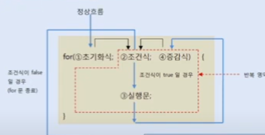

# for문

for문이 처음 실행될 때 ①초기화식이 제일 먼저 실행된다. 그런 다음
②조건식을 평가해서 true이면 ③실행문을 실행시키고, false이면 for문을 
실행 시키지 않고 끝나게된다. 블록 내부의 ③실행문들이 모두 실행되면 
④증감식을 실행시키고, 다시 ②조건식을 평가하게 된다. 평가 결과가 true이면
③ -> ④ -> ②로 다시 진행하고, false이면 for문이 끝나게 된다.

