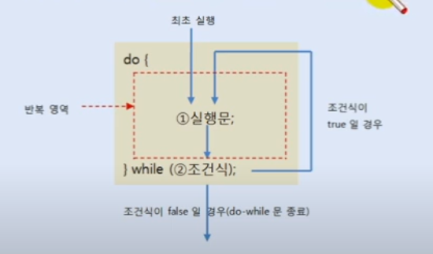

# do-while 문

do-while문은 조건식에 의해 반복 실행한다는 점에서 while문과 동일하다.
while문은 시작할 때 부터 조건식을 검사하여 블록 내부를 실행할지
결정하지만, 경우에 따라서는 블록 내부의 실행 문을 우선 실행시키고
실행 결과에 따라서 반복 실행을 계속할지 결정하는 경우도 발생한다.
이때 do-while문을 사용할 수 있다. 예를 들어 키보드로 입력받은 내용을 
조사하여 계속 루프를돌 것인지를 판단하는 프로그램이 있다고 가정하자.
조건식은 키보드로 입력받은 이후에 평가되어야 하므로, 우선적으로 
키보드로부터 입력된 내용을 받아야 한다.

다음은 do-while문의 작성 형식과 실행 흐름을 보여준다. 작성 시 
주의할 점은 while() 뒤에 반드시 세미콜론(;)를 붙여야 한다.

do-while문이 처음 실행될 때 ①실행문을 우선 실행한다. ①실행문이 모두 실행
되면 ②조건식을 평가하는데, 결과가 true이면 ① -> ②와 같이 반복 실행을
하고, 조건식의 결과가 false이면 do-while문을 종료한다.



이번 예제는 키보드로부터 문자열을 입력받고 출력시킨다. 먼저 콘솔에서 
입력한 문자열을 읽는 방법에 대해 알아보자. System.in.read() 메소드는
하나의 키 코드만 읽기 때문에 콘솔에 입력된 문자열을 한 번에 읽을 수 없다.
대신 다음과 같이 Scanner 객체를 생성하고 nextLine() 메소드를 호출하면
콘솔에 입력된 문자열을 한 번에 읽을 수 있다. nextLine() 메소드로 읽은 
문자열을 저장하기 위헤서는 String 변수가 필요한데, 아래 코드에서는
inputString 변수에 저장했다.

```java
Scanner scanner = new Scanner(System.in); // Scanner 객체 생성
String InputString = scanner.nextLine(); // nextLine() 메소드 호출
```

`DoWhileExample.java`  do-while 문

```java
public class DoWhileExample {
    public static void main(String[] args) {
        System.out.println("메세지를 입력하세요");
        System.out.println("프로그램을 종료하려면 q를 입력하세요");
        Scanner sc = new Scanner(System.in);
        String inputString;
        do {
            System.out.println(">");
            inputString = sc.nextLine();
            System.out.println(inputString);
        }while (!inputString.equals("q"));

        System.out.println();
        System.out.println("프로그램 종료");
    }
}

```