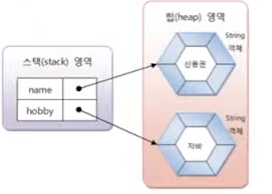
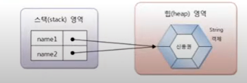
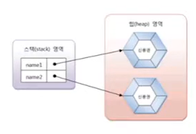

# String 타입

자바는 문자열을 String 변수에 저장하기 때문에 다음과 같이 String 
변수를 우선 선언해야 한다.

```java
String 변수;
```

String 변수에 문자열을 저장하려면 큰 따옴표로 감싼 문자열
리터럴을 대입하면 된다.

```java
변수 = "문자열"
```
변수 선언과 동시에 문자열을 저장할 수도 있다.

```java
String 변수 = "문자열";
```

다음은 두 개의 String 변수를 선언하고 문자열을 저장한다.
```java
String name;
name = "신용권";
String hobby = "자바";
```


사실 문자열을 String 변수에 저장한다는 말은 틀린 표현이다.
문자열이 직접 변수에 저장되는 것이 아니라, 문자열은 String 객체로
생성되고 변수는 String 객체를 참조한다. 하지만 일반적으로
String 변수에 저장한다는 표현을 사용한다. 
위 그림을 보면 name 변수와 hobby 변수는 스택 영역에 생성되고
문자열 리터럴인 "신용권"과 "자바"는 힙영역에 String 
객체로 생성된다. 그리고 name 변수와 hobby 변수에는
String 객체의 주소 값이 저장된다.

자바는 문자열 리터럴이 동일하다면 String 객체를 공유하도록
되어 있다. 다음과 같이 name1과 name2 변수가 동일한
문자열인 "신용권"을 참조할 경우 name1과 name2는
동일한 String 객체를 참조하게 된다.

```java
String name1 = "신용권";
String name2 = "신용권";
```



일반적으로 변수에 문자열을 저장할 경우에는
문자열 리터럴을 사용하지만, new 연산자를 사용해서
직접 String 객체를 생성시킬 수도 있다. 
new 연산자는 힙 영역에 새로운 객첼르 만들 때 사용하는
연산자로 객체 생성 연산자라고 한다.

```java
String name1 = new String("신용권");
String name2 = new String("신용권");
```



문자열 리터럴로 생성하느냐 new 연산자로 생성하느냐에 따라
비교 연산자의 결과가 달라질 수 있다. 
동일한 문자열 리터럴로 String 객체를 생성했을 경우
== 연산의 결과는 true가 나오지만, new 연산자로
String 객체를 생성했을 경우 == 연산의 결과는 false가
나온다 . == 연산자는 변수에 저장된 객체 번지가
동일한지를 검사하기 때문이다.

```java
String name1 = "신민철";
String name2 = "신민철";
String name3 = new String("신민철");
```

name1과 name2는 동일한 문자열 리터럴로 생성된
객체를 참조하기 때문에 name1 == name2 의 결과는
true가 나온다. 그러나 name3은 new 연산자로 String
객체를 별도로 생성했기 때문에 name1== name3은 false가
나온다. 동일한 String 객체이건 다른 String 객체이건
상관없이 문자열만을 비교할 때에는 String 객체의
equals() 메소드를 사용해야 한다. 
equals() 메소드는 원본 문자열과 매개값으로
주어진 비교 문자열이 동일한지 비교한 후 true 또는
false 를 리턴한다.

```java
boolean result = str1.equals(str2);
```

```java

public class StringEqualsExample {
    public static void main(String[] args) {
        String strVar1 = "신민철";
        String strVar2 = "신민철";

        if (strVar1 == strVar2){
            System.out.println("strVar1과 strVar2는 참조가 같음");
        }else {
            System.out.println("strVar1과 strVar2는 참조가 다름");
        }

        if(strVar1.equals(strVar2)){
            System.out.println("strVar1과 strVar2는 문자열이 같음");
        }

        String strVar3 = new String("신민철");
        String strVar4 = new String("신민철");

        if (strVar3==strVar4){
            System.out.println("strVar3과 strVar4는 참조가 같음");
        }else{
            System.out.println("strVar3과 strVar4는 참조가 다름");
        }

        if (strVar3.equals(strVar4)){
            System.out.println("strVar3과 strVar4는 문자열이 같음 ");
        }
    }
}

```

String 변수는 참조 타입이므로 초기값으로 null을
대입할 수 있다. null은 String 변수가 참조하는
String 객체가 없다는 뜻이다.

```java
String hobby = null;
```

다음 코드처럼 hobby 변수가 String 객체를 참조하였으나,
null을 대입함으로써 더 이상 String 객체를
참조하지 않도록 할 수 있다.
```java
String hobby = "여행";
hobby = null;
```

그렇다면 참조를 잃은 String 객체는 어떻게 될까?
JVM은 참조되지 않은 객체를 쓰레기 객체로 취급하고
쓰레기 수집기(Garbage Collector)를 구동시켜 메모리에서
자동 제거한다.

