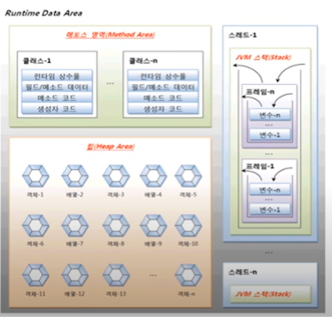
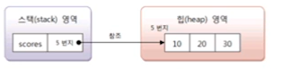
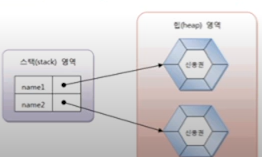

## 메모리 사용 영역 ( 강의 5-2.)

본격적으로 참조 타입을 알아보기 전에 우선 JVN이 사용하는 메모리 영역에
대해서 알아보기로 하자. java.exe로 JVM이 시작되면
JVM은 운영체제에서 할당 받은 메모리 영역을 메소드 영역, 힙 영역, 
JVM 스택 영역으로 구분해서 사용한다. 



## 메소드 영역 (Method) 영역

메소드 영역에는 코드에서 사용되는 클래스(~.class)들을 클래스 로더로
읽어 클래스별로 런타임 상수풀(runtime constant pool) ,
필드(field) 데이터, 메소드(method) 데이터,
메소드 코드 , 생성자(constructor) 코드 등을 분류해서 저장한다.
메소드 영역은 JVM이 시작할 때 생성되고 모든 스레드가 공유하는 영역이다.

## 힙(Heap) 영역
힙 영역은 객체와 배열이 생성되는 영역이다. 힙 영역에 생성된 객체와 배열은
JVM 스택 영역의 변수나 다른 객체의 필드에서 참조한다. 참조하는 변수나
필드가 없다면 의미 없는 객체가 되기 때문ㅁ에 이것을 쓰레기로 취급하고
JVM은 쓰레기 수집기(Garbage Collector)를 실행시켜 쓰레기 객체를
힙 영역에서 자동으로 제거한다. 그렇기 때문에 개발자는 객체를 제거하기 위해
별도의 코드를 작성할 필요가 없다. 사실 자바는 코드로 객체를 직접
제거시키는 방법을 제공하지 않는다. 

## JVM 스택(Stack) 영역

JVM 스택 영역은 각 스레드마다 하나씩 존재하며 스레드가 시작 될 때 할당된다.
자바 프로그램에서 추가적으로 스레드를 생성하지 않았다면 main 스레드만
존재하므로 JVM 스택도 하나이다. JVM 스택은 메소드를 호출할 때마다
프레임(Frame)을 추가(push)하고 메소드가 종료되면 해당 프레임을 제거(pop)
하는 동작을 수행한다. 예외 발생 시 printStackTrace() 메소드로 보여주는
Stack Trace의 각 라인은 하나의 프레임을 표현한다. printStackTrace() 
메소드는 예외 처리에서 설명한다.

프레임 내부에는 로컬 변수 스택이 있는데, 기본 타입 변수와 참조 타입 변수가
추가(push)되거나 제거(pop)된다. 변수가 이 영역에 생성되는 시점은
초기화가 될 때, 즉 최초로 변수에 값이 저장될 때이다.
변수는 선언된 블록 안에서만 스택에 존재하고 블록을 벗어나면 스택에서
제거된다. 다음 코드를 보자.
```java
 char v1 = 'A';  // 1

if(v1=='A'){
    int v2 = 100;
    double v3 = 3.14;
} // 2

boolean v4 = true;
// 3
```
선언된 변수는 실행 순서에 따라서 다음과 같이 스택에 생성되고 소멸된다. 
v2와 v3는 if 블록 내부가 실행되고 있을 때만 스택 영역에 존재하고
실행 흐름이 if 블록을 빠져나가면 소멸된다.

기본 타입 변수는 스택 영역에 직접 값을 가지고 있지만,
참조 타입 변수는 값이 아니라 힙 영역이나 메소드 영역의 객체 주소를 가진다.

다음과 같이 배열 변수인 scores 는 스택 영역에 생성되지만 실제
10,20,30 을 갖는 배열은 힙 영역에 생성된다.
배열 변수 scores에는 배열의 힙 영역의 주소가 저장된다.
참고로 자바에서는 배열을 객체로 취급한다.

```java
int [] scores = {10,20,30};
```




