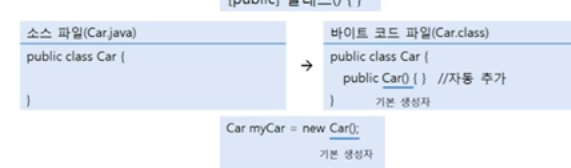

# 기본 생성자 

모든 클래스는 생성자가 반드시 존재하며, 하나 이상을 가질 수 있다. 우리가 클래스 내부에 생성자 선언을 생략했다면
컴파일러는 다음과 같이 중괄호 {} 블록 내용이 비어있는 기본 생성자(Default Constructor)를 바이트 코드에 자동 추가시킨다.

```java
[public]  클래스() {}
```
클래스가 public class로 선언되면 기본 생성자에서도 public이 붙지만, 클래스가 public 없이 class로만 선언되면 
기본 생성자에도 public이 붙지 않는다. 

예를 들어 Car 클래스를 설계할 때 생성자를 생략하면 기본 생성자가 다음과 같이 생성된다.



그렇기 때문에 클래스에 생성자를 선언하지 않아도 다음과 같이 new 연산자 뒤에 기본 생성자를 호출해서 객체를 
생성시킬 수 있다.
```java
Car myCar = new Car(); <= 기본 생성자
```

그러나 클래스에 명시적으로 선언한 생성자가 한 개라도 있으면, 컴파일러는 기본 생성자를 추가하지 않는다.
명시적으로 생성자를 선언하는 이유는 객체를 다양하게 초기화하기 위해서이다. 