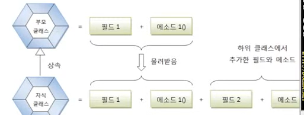

# 상속 의 개념

현실에서 상속(Inheritance)은 부모가 자식에게 물려주는 행위를 말한다. 자식은 상속을 통해서 부모가 물려준 것을
자연스럽게 이용할 수 있다. 객체 지향 프로그램에서도 부모 클래스의 멤버를 자식 클래스에게 물려줄 수 있다. 
프로그램에서는 부모 클래스를 상위 클래스라고 부르기도 하고, 
자식 클래스를 하위 클래스, 또는 파생 클래스라고 부른다.



상속은 이미 잘 개발된 클래스를 재사용해서 새로운 클래스를 만들기 때문에 코드의 중복을 줄여준다.
field1, field2, method1() , method2()를 가지는 클래스를 작성한다고 생각해보자.
4개를 모두 처음부터 작성하는 것보다는 field1과 method1()을 가지고 있는 클래스가 있다면 이것을 상속하고,
filed2와 method2()만 추가 작성하는 것이 보다 효율적이고 개발 시간을 절약시켜준다.


부모 클래스 A.java

```java
public class A{
    int field1;
    void method1() {...}
}
```

자식 클래스 B.java
```java
public class B extends A{
    String field2;
    void method2(){...}
}
```

```java
B b = new B();
b.field1 = 10;
b.method1();   // A로 부터 불려 받은 필드와 메소드

b.field2 = "홀길동";
b.method2(); // B가 추가한 필드와 메소드
```

상속을 해도 부모 클래스의 모든 필드와 메소드들을 물려받는 것은 아니다. 부모 클래스에서
private 접근 제한을 갖는 필드와 메소드는 상속 대상에서 제외된다. 
그리고 부모 클래스와 자식 클래스가 다른 패키지에 존재한다면 default 접근 제한을 갖는 필드와 메소드도 상속 대상에서 제외된다.
상속을 이용하면 클래스의 수정을 최소화 시킬수도 있다. 부모 클래스의 수정으로 모든 자식 클래스들의 수정 효과를  가져오기 때문에
유지 보수 시간을 최소화 시켜준다. 예를 들어 클래스 B,C가 클래스 A를 상속할 경우 A의 필드와 메소드를 수정함으로써 B,C를
수정하지 않아도 수정된 A의 필드와 메소드를 이용할 수 있다.

