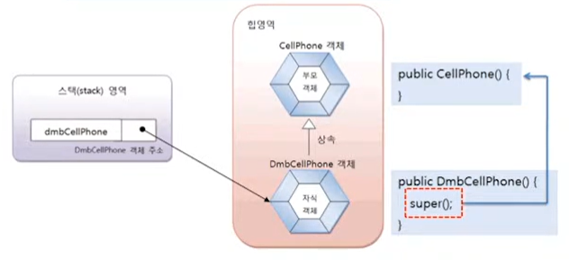

# 부모 생성자 호출

현실에서 부모 없는 자식이 있을 수 없듯이 자바에서도 자식 객체를 생성하면, 부모 객체가 먼저 생성되고
자식 객체가 그 다음에 생성된다. 아래 코드는 DmbCellPhone 객체만 생성하는 것처럼 보이지만,
사실은 내부적으로 부모인 CellPhone 객체가 먼저 생성되고, DmbCellPhone 객체가 생성된다.

```java
DmbCellPhone dmbCellPhone = new DmbCellPhone();
```

이것을 메모리로 표현하면 다음과 같다.



모든 객체는 클래스의 생성자를 호출해야만 생성된다. 부모 객체도 예외는 아니다. 그렇다면 부모 객체를
생성하기 위해 부모 생성자를 어디서 호출한 것일까? 이것에 대한 비밀은 자식 생성자에 숨어 있다.
부모 생성자는 자식 생성자의 맨 첫 줄에서 호출된다. 예를 들어 DmbCellPhone의 생성자가 명시적으로
선언되지 않았다면 컴파일러는 다음과 같은 기본 생성자를 생성해 낸다.

```java
public DmbCellPhone(){
    super();    
}
```

첫 줄에 super(); 가 추가된 것을 볼 수 있다. super()는 부모의 기본 생성자를 호출한다. 즉 CellPhone 클래스의
다음 생성자를 호출한다.
```java
public CellPhone(){
    
}
```

CellPhone.java 소스 코드에서도 CellPhone의 생성자가 선언되지 않았지만 컴파일러에 의해 기본 생성자가 만들어지므로
문제없이 실행된다. 만약 여러분이 직접 자식 생성자를 선언하고 명시적으로 부모 생성자를 호출하고 싶다면 
다음과 같이 작성하면 된다.

```java
자식클래스(매개변수선언, ...){
    super(매개값, ...);    
}
```

super(매개값, ...)는 매개값의 타입과 일치하는 부모 생성자를 호출한다. 만약 매개값의 타입과 일치하는
부모 생성자가 없을 경우 컴파일 오류가 발생한다. super(매개값, ...)가 생략되면 컴파일러에 의해
super()가 자동적으로 추가되기 때문에 부모의 기본 생성자가 존재해야 한다. 
부모 클래스에 기본 생성자가 없고 매개 변수가 있는 생성자만 있다면 자식 생성자에게 반드시 부모 생성자
호출을 위해 super(매개값, ...)를 명시적으로 호출해야 한다. super(매개값, ...)는 반드시 자식 생성자
첫 줄에 위치해야 한다. 그렇지 않으면 컴파일 에러가 난다.

`People.java` 부모 클래스

```java
public class People {

    public String name;
    public String ssn;

    public People(String name, String ssn) {
        this.name = name;
        this.ssn = ssn;
        System.out.println("부모 객체 생성 완료");
    }
}

```

People 클래스는 기본 생성자가 없고 name과 ssn을 매개값으로 받아 객체를 생성시키는 생성자만 있다.
그렇기 때문에 People을 상속하는 Student 클래스는 생성자에서 super(name , ssn)으로 People 클래스의 생성자를 
호출해야 한다.


`Student.java` 자식 클래스

```java
public class Student extends People {

    public int studentNo;

    public Student(String name, String ssn ,int studentNo) {
        super(name, ssn);
        this.studentNo = studentNo;
        System.out.println("자식 객체 생성 완료");
    }
}

```

Student 클래스의 생성자는 name, ssn , studentNo를 매개값으로 받아서 name과 ssn은 다시 부모 생성자를 
호출하기 위해 매개값으로 넘겨준다. 5라인의 super(name, ssn)은 People 생성자인 
People(String name, String ssn)을 호출한다. 만약에 5라인을 주석 처리하면
"Implicit super constructor People() is undefinded. Must explicitly invoke another constructor"
라는 컴파일 오류가 발생한다. 이것은 부모의 기본 생성자가 없으니 다른 생성자를 명시적으로 호출하라는 것이다. 