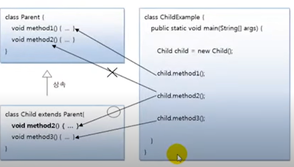

# 메소드 재정의

부모 클래스의 모든 메소드가 자식 클래스에게 맞게 설계 되어있다면 가장 이상적인 상속이지만,
어떤 메소드는 자식 클래스가 사용하기에 적합하지 않을 수도 있다. 이 경우 상속된 일부 메소드는
자식 클래스에서 다시 수정해서 사용해야 한다. 

## 메소드 재정의(@Override)

메소드 오버라이딩은 상속된 메소드의 내용이 자식 클래스에 맞지 않을 경우, 자식 클래스에서 동일한 메소드를 
재정의 하는 것을 말한다. 메소드가 오버라이딩되었다면 부모 객체의 메소드는 숨겨지기 때문에,
자식 객체에서 메소드를 호출하면 오버라이딩된 자식 메소드가 호출된다.



메소드를 오버라이딩할 때는 다음과 같은 규칙에 주의해서 작성해야 한다.

- 부모의 메소드와 동일한 시그너처(리턴 타입, 메소드 이름, 매개 변수 리스트)를 가져야 한다.
- 접근 제한을 더 강하게 오버라이딩할 수 없다.
- 새로운 예외(Exception)를 throws 할 수 없다.

접근 제한을 더 강하게 오버라이딩할 수 없다는 것은 부모 메소드가 public 접근 제한을 가지고 있을 경우
오버라이딩하는 자식 메소드는 defalut 나 private 접근 제한으로 수정할 수 없다는 뜻이다.
반대는 가능하다. 부모 메소드가 default 접근 제한을 가지면 재정의되는 자식 메소드는 default 
또는 public 접근 제한을 가질 수 있다. 다음 예제는 Calculator의 자식 클래스인 Computer에서
원의 넓이를 구하는 Calculator의 areaCircle() 메소드를 사용하지 않고, 좀 더 정확한 원의 넓이를
구하도록 오버라이딩했다. 

`Calculator.java` 부모 클래스

```java
public class Calculator {

    double areaCircle(double r){
        System.out.println("Calculator 객체의 areaCircle() 실행");

        return 3.14159 *r *r;
    }
}

```

`Computer.java` 자식 클래스

```java

public class Computer extends Calculator{

    @Override
    double areaCircle(double r) {
        super.areaCircle(r);
        System.out.println("Computer 객체의 areaCircle 실행");
        return Math.PI * r * r;
    }
}
```

Calculator의 areaCircle() 메소드는 파이의 값을 3.14159로 계산하였지만,
좀 더 정밀한 계산을 위해 Computer의 areaCircle() 메소드는 Math.PI 상수를 이용한다.

Math는 수학 계산과 관련된 필드와 메소드들을 가지고 있는 클래스로, 자바 표준 API를 제공한다.

@override 어노테이션은 생략해도 좋으나, 이것을 붙여주게 되면 areaCircle() 메소드가
정확히 오버라이딩된 것인지 컴파일러가 체크하기 때문에 개발자의 실수를 줄여준다. 
예를 들어 개발자가 areaCircl() 처럼 끝에 e를 빼먹게 되면 컴파일 어레가 발생한다.

`ComputerExample.java` 메소드 오버라이딩 테스트

```java

public class ComputerExample {

    public static void main(String[] args) {

        int r = 10;

        Calculator calculator = new Calculator();
        System.out.println("원 면적 : " + calculator.areaCircle(r));

        Computer computer = new Computer();
        System.out.println("원 면적 : " + computer.areaCircle(r));
    }
}

```

