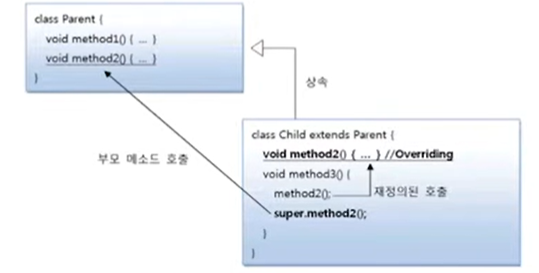

# 부모 메소드 호출(super)

자식 클래스에서 부모 클래스의 메소드를 오버라이딩하게 되면, 부모 클래스의 메소드는 숨겨지고
오버라이딩된 자식 메소드만 사용된다. 그러나 자식 클래스 내부에서 오버라이딩된 부모 클래스의
메소드를 호출해야 하는 상황이 발생한다면 명시적으로 super 키워드를 붙여서 부모 메소드를 호출할 수
있다. super는 부모 객체를 참조하고 있기 때문에 부모 메소드에 직접 접근할 수 있다. 

```java
super.부모메소드();
```





Airplane 클래스를 상속해서 SupersonicAirplane 클래스를 만들어 보자. Airplane의 fly() 메소드는
일반 비행이지만 SupersonicAirplane의 fly()는 초음속 비행 모드와 일반 비행 모드 두가지로
동작하도록 설계 해보자

`Airplane.java`  super 변수

```java
public class Airplane {

    public void land(){
        System.out.println("착륙합니다.");
    }

    public void fly(){
        System.out.println("일반 비행합니다.");
    }

    public void takeOff(){
        System.out.println("이륙합니다. ");
    }
}
```

`SupersonicAirplane.java` super 변수

```java
public class SupersonicAirplane extends Airplane {

    public static final int NORMAL = 1;
    public static final int SUPERSONIC = 2;

    public int flyMode = NORMAL;

    @Override
    public void fly() {
       if (flyMode == SUPERSONIC){
           System.out.println("초음속 비행합니다.");
       }else{
           //Airplane 객체의 fly() 메소드 호출
           super.fly();

       }
    }
}
```

`SupersonicAirplaneExample.java` super 변수

```java
public class SupersonicAirplaneExample {

    public static void main(String[] args) {
        SupersonicAirplane sa = new SupersonicAirplane();
        sa.takeOff();
        sa.fly();
        sa.flyMode = SupersonicAirplane.SUPERSONIC;
        sa.fly();
        sa.flyMode = SupersonicAirplane.NORMAL;
        sa.fly();
        sa.land();
    }
}
```