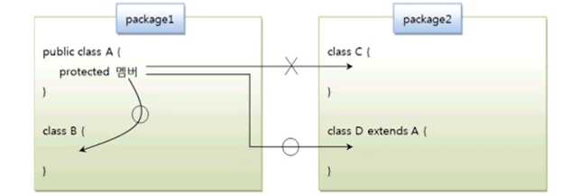

# protected 접근 제한자

접근 제한자는 public, protected, default , private 와 같이 네 가지 종류가 있다.
이 중에서 protected 는 상속과 관련이 있기 때문에 설명을 미루어 왔는데, 이제 protected 가
어떤 역할을 하는지 알아보자 

| 접근 제한 | 적용할 내용 | 접근할 수 없는 클래스 |
|----- |:---| ---:| 
| public | 클래스 필드, 생성자, 메소드 | 없음 |
| protected | 필드, 생성자, 메소드 | 자식 클래스가 아닌 다른 패키지에 소속된 클래스|
| default | 클래스 ,필드, 생성자 ,메소드 | 다른 패키지에 소속된 클래스
| private | 필드, 생성자, 메소드 | 모든 외부 클래스 

protected는 public과 default 접근 제한의 중간쯤에 해당한다. 같은 패키지에서는 
default와 같이 접근 제한이 없지만 다른 패키지에서는 자식 클래스만 접근을 허용한다.

즉, 패키지가 달라도 자식 클래스이면 필드, 생성자, 메소드에 접근이 가능하다. 

protected는 필드와 생성자, 메소드 선언에 사용될 수 있다. 다음 A 클래스를 보면
protected로 선언된 필드, 생성자, 메소드가 있다.

