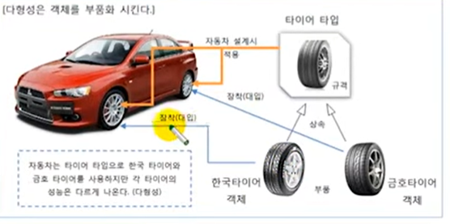

# 타입 변환과 다형성

다형성은 같은 타입이지만 실행 결과가 다양한 객체를 이용할 수 있는 성질을 말한다.
코드 측면에서 보면 다형성은 하나의 타입에 여러 객체를 대입함으로써 다양한 기능을 이용할 수 있도록
해준다. 다형성을 위해 자바는 부모 클래스로 타입 변환을 허용한다. 즉 부모 타입에 모든 자식 객체가
대입될 수 있다. 이것을 이용하면 객체는 부품화가 가능하다. 예를 들어 자동차를 설계할 때 타이터
클래스 타입을 적용햇다면 이 클래스를 상속한 실제 타이어들은 어떤 것이든 상관없이 장착(대입)이 가능하다.



위 그림을 코드로 표현하면 다음과 같다.

```java

public class Car {
    Tire t1 = new HankookTire();
    Tire t2 = new KumhoTire();
}
```

타입 변환이란 데이터 타입을 다른 데이터 타입으로 변환하는 행위를 말한다
클래스 타입도 기본 타입의 변환과 마찬가지로 타입 변환이 있다. 클래스 타입의 변환은
상속 관계에 있는 클래스 사이에서 발생한다. 자식 타입은 부모 타입으로 자동 타입 변환이 가능하다.
