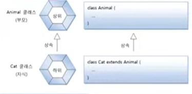
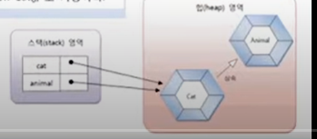
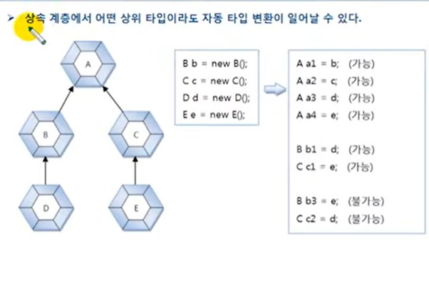
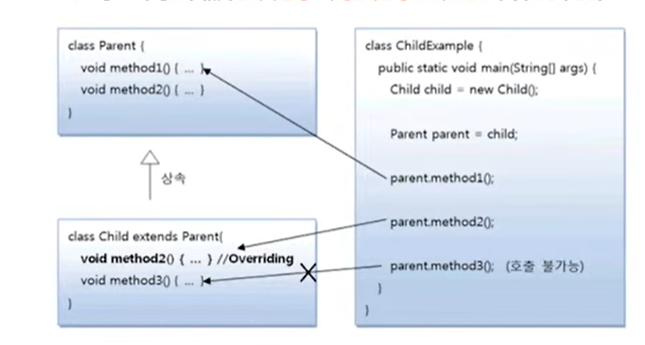

# 자동 타입 변환(Promotion)

자동 타입 변환(Promotion)은 프로그램 실행 도중에 자동적으로 타입 변환이 일어나는 것을 말한다.


자동 타입 변환의 개념은 자식은 부모의 특징과 기능을 상속받기 때문에 부모와 동일하게
취급될 수 있다는 것이다. 예를 들어 고양이는 동물의 특징과 기능을 상속 받았다. 
그래서 "고양이는 동물이다."가 성립한다. Animal 과 Cat 클래스가 다음과 같이 상속 관계에 있다고 보자




Cat 클래스로부터 Cat 객체를 생성하고 이것을 Animal 변수에 대입하면 자동 타입 변환이 일어난다.

```java
Cat cat = new Cat();
Animal animal = cat;
```

Animal animal = new Cat(); 도 가능하다.

위 코드로 생성되는 메모리 상태를 그림으로 묘사하면 다음과 같다. cat과 animal 변수는
타입만 다를 뿐, 동일한 Cat 객체를 참조한다.



위 그림에서 animal 변수가 Animal 타입이므로 당연히 부모인 Animal 객체를 참조하는 것이
맞지 않느냐고 생각할 수도 있지만, 사실은 그렇지 않다. 
다음과 같이 cat과 animal 변수를 == 연산해보면 true가 나오는데, 참조 변수의 == 연산은
참조 주소값이 같을 경우 true를 산출하므로 두 변수가 동일한 객체를 참조하고 있다는 뜻이다.

```java
cat == animal // true
```




부모 타입으로 자동 타입 변환된 이후에는 부모 클래스에 선언된 필드와 메소드만 접근이 가능하다.
비록 변수는 자식 객체를 참조하지만 변수로 접근 가능한 멤버는 부모 클래스 멤버로만 한정된다.
그러나 예외가 있는데, 메소드가 자식 클래스에서 오버라이딩되었다면 자식 클래스의 메소드가 
대신 호출된다. 이것은 다형성(Polymorphism)과 관련이 있기 때문에 매우 중요한 성질이므로
잘 알아두어야 한다. 



Child 객체는 method3() 메소드를 가지고 있지만, Parent 타입으로 변환된 이후에는 method3()을 
호출할 수 없다. 그러나 method2() 메소드는 부모와 자식 모두에게 있다. 

`Parent.java` 자동 타입 변환 후의 멤버 접근
```java
public class Parent {
    public void method1(){
        System.out.println("Parent-method()1");
    }

    public void method2(){
        System.out.println("Parent-method()2");
    }
}

```

`Child.java` 자동 타입 변환 후의 멤버 접근

```java

public class Child extends Parent{

    @Override
    public void method2() {
        System.out.println("Child-method()2");  // 재정의
    }

    public void method3(){
        System.out.println("Child-method()3");
    }
}

```

`ChildExample.java`  자동 타입 변환 후의 멤버 접근

```java

public class ChildExample {

    public static void main(String[] args) {
        Child child = new Child();

        Parent parent = child;

        parent.method1();
        parent.method2();

//        parent.method3(); // 호출 불가능

        System.out.println("---------------------------");

        Parent parent1 = new Child();
        parent1.method1();
        parent1.method2();
//        parent1.method3();

        System.out.println("----------------------------");
        Child child1 = new Child();
        child1.method1();
        child1.method2();
        child1.method3();

    }
}
```
```java

Parent-method()1
Child-method()2
---------------------------
Parent-method()1
Child-method()2
----------------------------
Parent-method()1
Child-method()2
Child-method()3
```
