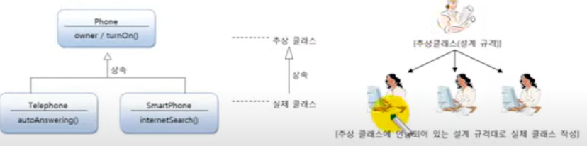

# 추상 클래스의 용도

실체 클래스들의 공통적인 특성(필드, 메소드)을 뽑아내어 추상 클래스로 만드는 이유가 무엇일까?

### 실체 클래스들의 공통된 필드와 메소드의 이름을 통일할 목적

실체 클래스를 설계하는 사람이 여러 사람일 경우, 실체 클래스마다 필드와 메소드가 제각기 다른 이름을 가질
수 있다. 예를 들어 소유자의 이름을 저장하는 필드를 Telephone 에서는 owner 라고 하고, SmartPhone에는
user라고 할 수 있다. 그리고 전원을 켜다라는 메소드를 Telephone에서는 turnOn()으로 설계하고,
SmartPhone에서는 powerOn() 이라고 설계 할 수 있다. 동일한 데이터와 기능임에도 불구하고 
이름이 다르다 보니, 객체마다 사용 방법이 달라진다. 이것보다는 Phone 이라는 추상 클래스에 
소유자인 owner 필드와 turnOn() 메소드를 선언하고, Telephone과 SmartPhone은 phone을 상속함으로써
필드오 메소드 이름을 통일 시킬 수 있다. 

### 실체 클래스를 작성할 때ㅔ 시간을 절약

공통적인 필드와 메소드는 추상 클래스인 Phone에 모두 선언해 두고, 실체 클래스마다 다른 점만 실체 클래스에
선언하게 되면 실체 클래스를 작성하는데 시간을 절약할 수 있다. 아래 그림에서
보면 Telephone과 SmartPhone은 Phone을 상속받기 때문에 owner 필드와 turnOn()  메소드를 
선언할 필요가 없다.

