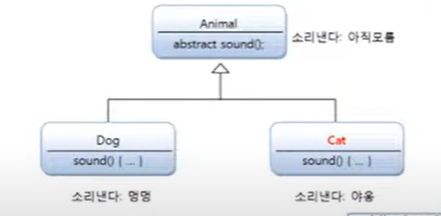

# 추상 메소드와 오버라이딩

추상 클래스는 실체 클래스가 공통적으로 가져야 할 필드와 메소드들을 정의해 놓은 추상적인 클래스이므로
실체 클래스의 멤버(필드, 메소드)를 통일화하는데 목적이 있다. 모든 실체들이 가지고 있는 메소드의
실행 내용이 동일하다면 추상 클래스에 메소드를 작성하는 것이 좋을 것이다. 하지만 메소드의 선언만
통일화하고, 실행 내용은 실체 클래스마다 달라야 하는 경우가 있다. 예를 들어 모든 동물은 소리를 내기
때문에 Animal 추상 클래스에서 sound() 라는 메소드를 정의했다고 하자. 그렇다면 어떤 소리를 내도록
해야 하는데, 이것은 실체에서 직접 작성해야 될 부분임을 알게 된다. 

왜냐하면 동물은 다양한 소리를 내기 때문에 이것을 추상 클래스에서 통일적으로 작성 할 수 없기 때문이다.
그렇다고 해서 sound() 메소드를 실체에서 작성하도록하면 sound() 메소드를 잊어 버리고 작성하지 않을 수도
있기 때문에 동물은 소리를 낸다는 것에 위배된다.

이런 경우를 위해서 추상 클래스는 추상 메소드를 선언할 수 있다. 추상 메소드는 추상 클래스에서만 선언할 수
있는데, 메소드의 선언부만 있고 메소드 실행 내용인 중괄호 {}가 없는 메소드를 말한다.

추상 클래스를 설계할 때 , 하위 클래스가 반드시 실행 내용을 채우도록 강요하고 싶은 메소드가  있을 경우,
해당 메소드를 추상 메소드로 선언하면 된다.  자식 클래스는 반드시 추상 메소드를 재정의(오버라이딩) 해서
실행 내용을 작성해야 하는데, 그렇지 않으면 컴파일 에러가 발생한다. 이것이 추상 메소드의 위력이다.

다음은 추상 메소드를 선언하는 방법을 보여준다.

```java
[public | protected abstract 리턴 타입 메소드명(매개변수, ...);
```

일반 메소드 선언과의 차이점은 abstract 키워드가 붙어 있고 메소드 중괄호 {}가 없다.
다음은 Animal 클래스를 추상 클래스로 선언하고 sound() 메소드를
추상 메소드로 선언한 것이다.

```java
public abstract class Animal{
    public abstract void sound();
}
```
어떤 소리를 내는지는 결정 할 수 없지만 동물은 소리를 낸다는
공통적인 특징이 있으므로 sound() 메소드를 추상 메소드로 선언했다.
Animal 클래스를 상속하는 하위 클래스는 고유한 소리를 내도록 sound()
메소드를 재정의해야 한다. 예를 들어 Dog는 "멍멍", Cat은 "야옹" 소리를
내도록 Dog, Cat 클래스에서 sound() 메소드를 재정의해야 한다.



`Animal.java` 추상 메소드 선언

```java
public abstract class Animal {

    public String kind;

    public void breathe(){

    }

    public abstract void sound();
}
```

`Dog.java` 추상 메소드 오버라이딩

```java
public class Dog extends Animal{
    @Override
    public void sound() {
        System.out.println("멍 멍");
    }

    public Dog() {
        this.kind = "포유류";
    }
}

```

`Cat.java` 추상 메소드 오버라이딩

```java
public class Cat extends Animal{

    public Cat() {
        this.kind ="포유류";
    }


    @Override
    public void sound() {
        System.out.println("냐옹~");
    }
}

```

밑에 AnimalExample 클래스는 Dog 와 Cat 객체를 생성해서
sound() 메소드를 호출 했다.

sound() 메소드를 호출하는 방법을 세 가지 방식으로 표현했다.
첫 번째는 가장 일반적인 방식으로 Dog 와 Cat 변수로 호출했고,

두 번째는 Animal 변수로 타입 변호나해서 sound() 메소드를
호출했다. 자식 타입은 부모 타입으로 자동 타입 변환이 될 수 있고,

메소드가 재정의되어 있을 경우 재정의된 자식 메소드가 호출되는
상속의 특징이 그대로 적용된다. 

세 번째는 부모 타입의 매개 변수에 자식 객체를 댕비해서
메소드의 다형성을 적용했다. 이것은 두 번째와 같은 원리로
자식 객체가 부모 타입으로 자동 타입 변환되어 재정의된
sound() 메소드가 호출된다. 

`AnimalExample.java` 실행 클래스
```java

public class AnimalExample {
    public static void main(String[] args) {
        Dog dog = new Dog();
        Cat cat = new Cat();

        dog.sound();
        cat.sound();
        System.out.println("------------------");

        //변수의 자동 타입 변환
        Animal animal;
        animal = new Dog();
        animal.sound();

        animal = new Cat();
        animal.sound();
        System.out.println("------------------------------");


        //메소드의 다형성
        animalSound(new Dog());
        animalSound(new Cat());
    }

    private static void animalSound(Animal animal) {
            animal.sound();
    }
}
```

