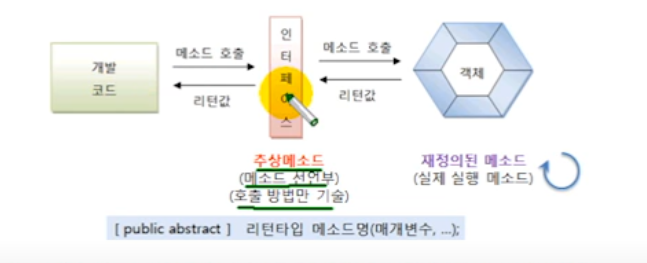

# 추상 메소드 선언

인터페이스를 통해 호출된 메소드는 최종적으로 객체에서 실행된다. 그렇기 때문에 인터페이스의
메소드는 실행 블록이 없는 추상 메소드로 선언한다. 추상 메소드는 리턴 타입, 메소드명, 매개 변수만
기술되고 중괄호 {}를 붙이지 않는 메소드를 말한다. 인터페이스에 선언된 추상 메소드는 모두 public abstract
의 특성을 갖기 때문에 public abstract를 생략하더라도 자동적으로 컴파일 과정에서 붙게 된다.



```java
public interface RemoteControl {

    int MAX_VOLUME = 10;
    int MIN_VOLUME = 0;

    void turnOn();
    void turnOff();
    void setVolume(int volume);
    
}

```