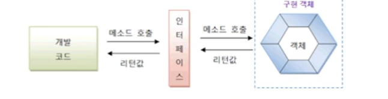

# 인터페이스 구현

개발 코드가 인터페이스 메소드를 호출하면 인터페이스는 객체의 메소드를 호출한다. 객체는 인터페이스에서
정의된 추상 메소드와 동일한 메소드 이름, 매개 타입, 리턴 타입을 가진 실체 메소드를 가지고 있어야 한다.
이러한 객체를 인터페이스의 구현(implement) 객체라고 하고, 구현 객체를 생성하는 클래스를 
구현 클래스라고 한다.

