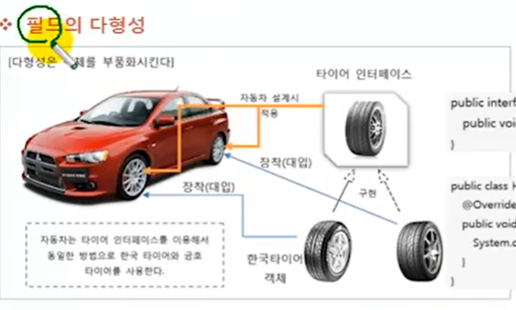

# 필드의 다형성

아래 그림은 상속에서 다형성을 설명할 때 보여준 그림과 유사하다. 상속에서는 타이어 클래스 타입에
한국 타이어와 금호 타이어라는 자식 객체를 대입해서 교체할 수 있음을 보여주었지만, 아래 그림은 
타이어가 클래스 타입이 아니고 인터페이스라는 점과 한국 타이어와 금호 타이어는 자식 클래스가 아니라
구현 클래스라는 점이다.

한국 타이어와 금호 타이어는 공통적으로 타이어 인터페이스를 구현했기 때문에 모두 타이어 인터페이스에 
있는 메소드를 가지고 있다. 따라서 타이어 인터페이스로 동일하게 사용할 수 있는 교체 가능한 객체에
해당한다. 



자동차를 설계할 때 다음과 같이 필드 타입으로 타이어 인터페이스를 선언하게되면 필드값으로 한국 타이어
또는 금호 타이어 객체를 대입할 수 있다. 자동 타입 변환이 일어나기 때문에
아무런 문제가 없다.

```java
public class Car {

    Tire frontLeftTire = new HankookTire();
    Tire frontRightTire = new HankookTire();
    Tire backLeftTire = new HankookTire();
    Tire backRightTire = new HankookTire();
}
```

Car 객체를 생성한 후, 초기값으로 대입한 구현 객체 대신 다른 구현 객체를 대입할 수도 있다.
이것이 타이어 교체에 해당한다.

```java
Car myCar = new Car();
myCar.frontLeftTire = new KumhoTire();
myCar.frontRightTire = new KumhoTIre();
```

frontLeftTire와 frontRightTire에 어떠한 타이어 구현 객체가 저장되어도 Car 객체는 타이어
인터페이스에 선언된 메소드만 사용하므로 전혀 문제가 되지 않는다. 

다음은 Car 객체의 run() 메소드에서 타이어 인터페이스에 선언된 roll() 메소드를 호출한다.

```java
void run(){
   frontLeftTire.roll();
   frontRightTire.roll();
   backLeftTire.roll();
   backRightTire.roll();
}
```

frontLeftTire와 frontRightTire를 교체하기 전에는 HankookTire 객체의 roll() 메소드가
호출 되지만, KumhoTire로 교체된 후에는 KumhoTire 객체의 roll() 메소드가 호출된다.

Car의 run () 메소드 수정 없이도 다양한 roll() 메소드의 실행 결과를 얻을 수 있게 되는 것이다.
이것이 필드의 다형성이다.

`Tire.java` 인터페이스

```java
public interface Tire {

    public void roll();

}

```

`HankookTire.java` 구현 클래스


```java

public class HankookTire implements Tire {
    @Override
    public void roll() {
        System.out.println("한국 타이어가 굴러갑니다.");
    }
}

```

```java

public class KumhoTire implements Tire {
    @Override
    public void roll() {
        System.out.println("금호 타이어가 굴러갑니다.");
    }
}

```

`Car.java` 필드 다형성

````java
public class Car {

    Tire frontLeftTire = new HankookTire();
    Tire frontRightTire = new HankookTire();
    Tire backLeftTire = new HankookTire();
    Tire backRightTire = new HankookTire();

    void run(){
        frontLeftTire.roll();
        frontRightTire.roll();
        backLeftTire.roll();
        backRightTire.roll();
    }
}

````

`CarExample.java` 필드 다형성 테스트
```java
public class CarExample {

    public static void main(String[] args) {
        Car myCar = new Car();

        myCar.run();

        myCar.frontLeftTire = new KumhoTire();
        myCar.frontRightTire = new KumhoTire();

        myCar.run();
    }
}

```

