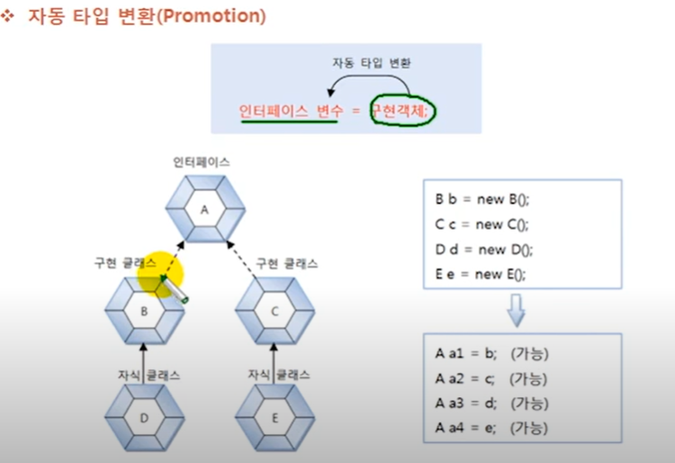

# 자동 타입 변환 (Promotion)

구현 객체가 인터페이스 타입으로 변환되는 것은 자동 타입 변환(Promotion)에 해당한다.
자동 타입 변환은 프로그램 실행 도중에 자동적으로 타입 변환이 일어나는 것을 말한다.

인터페이스 구현 클래스를 상속해서 자식 클래스를 만들었다면 자식 객체 역시 인퍼페이스 타입으로
자동 타입 변환시킬 수 있다.

자동 타입 변환을 이용하면 필드의 다형성과 매개 변수의 다형성을 구현할 수 있다. 필드와 매개 변수의 타입을
인터페이스로 선언하면 여기에 다양한 구현 객체를 대입해서 실행 결과를 다양하게 만들 수 있다.
