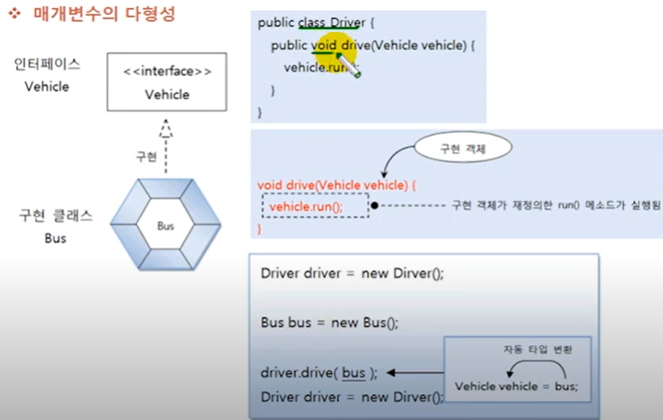
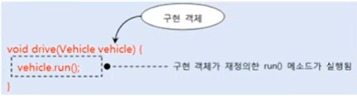

# 매개 변수의 다형성

자동 타입 변환은 필드의 값을 대입할 때에도 발생하지만, 주로 메소드를 호출할 때 많이 발생한다.
매개값을 다양화하기 위해서 상속에서는 매개 변수를 부모 타입으로 선언하고 호출할 때에는 자식 객체를
대입했었다. 이번에는 매개 변수를 인터페이스 타입으로 선언하고 호출할 때에는 구현 객체를 대입한다.
예를 들어 다음과 같이 Driver 클래스에는 drive() 메소드가 정의되어 있는데
Vehicle 타입의 매개 변수가 선언되어 있다.

```java
public class  Driver{
    public void drive(Vehicle vehicle){
        vehicle.run();
    }
}
```

Vehicle을 다음과 같이 인터페이스 타입이라고 가정해보자
```java
public interface Vehicle{
    public void run();
}
```

만약 Bus가 구현 클래스라면 다음과 같이 Driver의 drive() 메소드를 호출할 때 Bus 객체를 생성해서
매개값으로 줄 수 있다.



매개 변수의 타입이 인터페이스일 경우, 어떠한 구현 객체도 매개값으로 사용할 수 있고, 어떤 구현 객체가
제공되느냐에 따라 메소드의 실행 결과는 다양해질 수 잇다. (매개 변수의 다형성)



`Driver.java`  매개 변수의 인터페이스 화

```java

public class Driver {

    public void drive(Vehicle vehicle){
        vehicle.run();
    }
}

```

`Vehicle.java` 인터페이스

```java
public interface Vehicle {

    public void run();
}

```

`Bus.java`  구현 클래스

```java
public class Bus implements Vehicle{

    @Override
    public void run() {
        System.out.println("버스가 달립니다.");
    }
}

```

`Taxi.java` 구현 클래스

```java
public class Taxi implements Vehicle{

    @Override
    public void run() {
        System.out.println("택시가 달립니다.");
    }
}

```

`DriverExample.java` 매개 변수의 다형성 테스트

````java
public class DriverExample {

    public static void main(String[] args) {
        Driver driver = new Driver();

        Vehicle bus = new Bus();
        Vehicle taxi = new Taxi();

        driver.drive(bus);
        driver.drive(taxi);
    }
}

````
