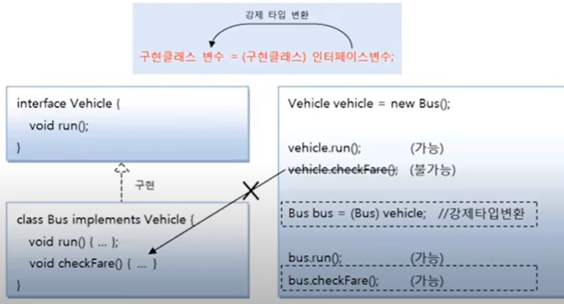

# 강제 타입 변환 (Casting)

구현 객체가 인터페이스 타입으로 자동 변환하면, 인터페이스에 선언된 메소드만 사용 가능하다는 
제약 사항이 따른다. 예를 들어 인터페이스에는 세 개의 메소드가 선언되어 있고, 
클래스에는 다섯 개의 메소드가 선언되어 있다면, 인터페이스로 호출 가능한  메소드는 세 개뿐이다.

하지만 경우에 따라서는 구현 클래스에 선언된 필드와 메소드를 사용해야 할 경우도 발생한다.
이때 강제 타입 변환을 해서 다시 구현 클래스 타입으로 변환한 다음, 구현 클래스의 필드와 메소드를
사용 할 수 있다.



`Vehicle.java` 인터페이스

```java
public interface Vehicle {

    public void run();
}

```

`Bus.java` 구현 클래스

```java

public class Bus implements Vehicle {
    @Override
    public void run() {
        System.out.println("버스가 달립니다.");
    }

    public void checkFare(){
        System.out.println("승차 요금을 체크합니다다");

    }
}
```

`VehicleExample.java` 강제 타입 변환

```java
public class VehicleExample {

    public static void main(String[] args) {
        Vehicle vehicle = new Bus();

        vehicle.run();
        //vehicle.checkFare();

        Bus bus = (Bus) vehicle;

        bus.run();
        bus.checkFare();
    }
}

```

