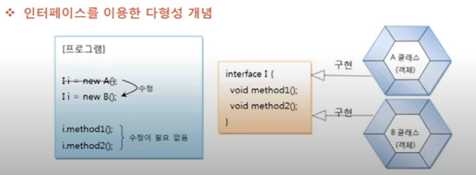
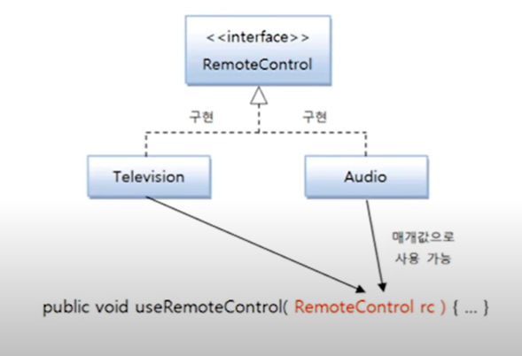

# 타입 변환과 다형성

상속에서 타입 변환과 다형성에 대해 알아보았는데, 인터페이스도 다형성을 구현하는 
기술이 사용된다. 오히려 요즘은 상속보다는 인터페이스를 통해서 다형성을 구현하는 경우가 더 많다.
다형성은 하나의 타입에 대입되는 객체에 따라서 실행 결과가 다양한 형태로 나오는 성질을 말한다. 
부모 타입에 어떤 자식 객체를 대입하느냐에 따라 실행 결과가 달라지듯이, 인터페이스 타입에 어떤 구현
객체를 대입하느냐에 따라 실행 결과가 달라진다. 상속은 같은 종류의 하위 클래스를 만드는 기술이고,
인터페이스는 사용 방법이 동일한 클래스를 만드는 기술이라는 개념적 차이점은 있지만 
둘 다 다형성을 구현하는 기술임에는 틀림없다.

프로그램을 개발할 때 인터페이스를 사용해서 메소드를 호출하도록 코딩을 했다면, 구현 객체를 교체하는 것은
매우 손쉽고 빠르게 할 수 있다. 프로그램 소스 코드는 변함이 없는데, 구현 객체를 교체함으로써 프로그램의
실행 결과가 다양해진다. 이것이 인터페이스의 다형성이다.

A 클래스를 이용해서 프로그램을 개발한다고 가정해보자. 개발 완료 후, 전체 프로그램을 테스트해보니
A 클래스에 문제가 있어 원하는 실행 결과가 나오지 않는다. 그래서 B 클래스로 바꾸기로 했다. 
하지만 B 클래스의 메소드는 A 클래스의 메소드와 이름, 매개 변수가 다르다. 어쩔  수 없이 A 클래스의
메소드가 사용 된 곳을 찾아서 B 클래스의 메소드로 변경해야 한다. 만약 A 클래스오 B 클래스의 
메소드 선언부(리턴 타입, 메소드명 , 매개 변수)가 동일하다면 어떻게 될까? 메소드 호출 방법이 
동일하므로 메소드 호출 코드는 수정할 필요 없이 객체 생성 부분만 A 클래스에서 B 클래스로 바꾸기만 하면
된다. 문제는 A,B 클래스를 설계할 때 메소드 선언부를 완전히 동일하게 설계할 수 있느냐 이다.
이 문제를 해결하려면 인터페이스를 작성하고 A,B 클래스는 구현 클래스로 작성하면 된다.

예를 들어 다음과 같이 I 인터페이스를 이용해서 프로그램을 개발하였다. I 인터페이스를 구현한 클래스로
처음에는 A 클래스를 선택한다. 개발 완료 후 테스트를 해보니 A 클래스에 문제가 생겨 다른 클래스를 
사용해야 한다. 이런 경우 I 인터페이스를 구현한 B 클래스를 만들고 단 한 줄만 수정해서 프로그램을 
재실행할 수 있다.

인터페이스는 메소드의 매개 변수로 많이 등장한다. 인터페이스 타입으로 매개 변수를 선언하면 메소드 호출 시
매개값으로 여러 가지 종류의 구현 객체를 줄 수 있기 때문에 메소드 실행 결과가 다양하게 나온다.
이것이 인터페이스 매개 변수의 다형성이다. useRemoteControl() 메소드의 매개 변수가 RemoteControl 
인터페이스 타입일 경우, 매개값으로 Television 객체 또는 Audio 객체를 선택적으로 줄 수 있다.

메소드 호출 시 어떤 구현 객체를 매개값으로 주느냐에 따라서 useRemoteControl() 메소드의 실행 결과는
다르게 나온다.