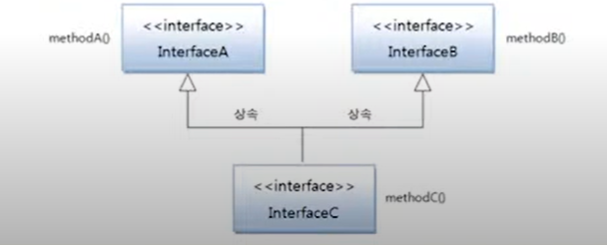

# 인터페이스 상속

인터페이스도 다른 인터페이스를 상속할 수 있다. 인터페이스는 클래스와는 달리 다중 상속을 허용한다.
다음과 같이 extends 키워드 뒤에 상속할 인터페이스들을 나열 할 수 있다.

```java
public interface 하위인터페이스 extends 상위인터페이스1, 상위인터페이스2 {...}
```

하위 인터페이스를 구현하는 클래스는 하위 인터페이스의 메소드뿐만 아니라 상위 인터페이스의 모든
추상 메소드에 대한 실체 메소드를 가지고 있어야 한다. 그렇기 때문에 구현 클래스로부터 객체를 생성하고
나서 다음과 같이 하위 및 상위 인터페이스 타입으로 변환이 가능하다.

```java
하위인터페이스 변수 = new 구현클래스(...);
상위인터페이스1 변수 = new 구현클래스(...);
상위인터페이스2 변수 = new 구현클래스(...);
```

하위 인터페이스로 타입 변환이 되면 상,하위 인터페이스에 선언된 모든 메소드를 사용할 수 있으나,
상위 인터페이스로 타입 변환되면 상위 인터페이스에 선언된 메소드만 사용 가능하고 하위 인터페이스에
선언된 메소드는 사용할 수 없다. 예를 들어 아래와 같이 인터페이스가 상속 관계가 있다고 가정해보자



InterfaceC 인터페이스 변수는 methodA() , methodB(), methodC()를 모두 호출할 수 있지만,

InterfaceA와 InterfaceB 변수는 각각 methodA() 와 methodB() 만 호출할 수 있다.

`InterfaceA.java` 부모 인터페이스

```java
public interface InterfaceA {
    public void methodA();
}

```

`InterfaceB.java `  부모 인터페이스

```java
public interface InterfaceB {
    public void methodB();
}

```

`InterfaceC.java` 하위 인터페이스

```java
public interface InterfaceC extends InterfaceA , InterfaceB {

    public void methodC();
}

```

`ImplementationC.java` 하위 인터페이스 구현

```java
public class ImplementationC implements InterfaceC{
    @Override
    public void methodA() {
        System.out.println("methodA() 실행");
    }

    @Override
    public void methodB() {
        System.out.println("methodB() 실행");
    }

    @Override
    public void methodC() {
        System.out.println("methodC() 실행");
    }
}

```

`Example.java` 호출 가능 메소드

```java
public class Example {
    public static void main(String[] args) {
        ImplementationC  impl = new ImplementationC();

        InterfaceA interfaceA = impl;
        interfaceA.methodA();      

        System.out.println();         

        InterfaceB interfaceB = impl;
        interfaceB.methodB();

        System.out.println();

        InterfaceC interfaceC = impl;
        interfaceC.methodA();
        interfaceC.methodB();
        interfaceC.methodC();

    }
}

```