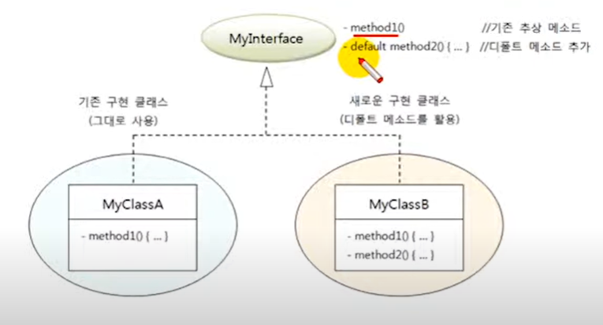

# 디폴트 메소드와 인터페이스 확장

디폴트 메소드는 인터페이스에 선언된 인스턴스 메소드이기 때문에 구현 객체가 있어야 사용할 수 있다.
선언은 인터페이스에서 하고, 사용은 구현 객체를 통해 한다는 것이 어색해 보인다.

디폴트 메소드는 모든 구현 객체에서 공유하는 기본 메소드처럼 보이지만, 사실은 인터페이스에서 
디폴트 메소드를 허용한 다른 이유가 있다.

## 디폴트 메소드의 필요성

인터페이스에서 디폴트 메소드를 허용한 이유는 기존 인터페이스를 확장해서 새로운 기능을 추가하기 
위해서이다. 기존 인터페이스의 이름과 추상 메소드의 변경 없이 디폴트 메소드만 추가할 수 있기 때문에
이전에 개발한 구현 클래스를 그대로 사용할 수 있으면서 새롭게 개발하는 클래스는 디폴트 메소드를
활용할 수 있다.

아래 그림을 보면서 이해해보자. 기존에 MyInterface라는 인터페이스와 이를 구현한 MyClassA라는 
클래스가 있었다. 시간이 흘러 MyInterface에 기능을 추가해야할 필요성이 생겼다. 그래서 MyInterface에
추상 메소드를 추가했는데, 엉뚱하게도 MyClassA에서 문제가 발생했다. 그 이유는 추가된 추상 메소드에
대한 실체 메소드가 MyClassA에 없기 때문이다. MyClassA를 수정할 여건이 안된다면 결국 MyInterface에
추상 메소드를 추가할 수 없다. 그래서 MyInterface에 디폴트 메소드를 선언하낟. 디폴트 메소드는 
추상 메소드가 아니기 때문에 구현 클래스에서 실체 메소드를 작성할 필요가 없다.
따라서 MyClassA는 아무런 문제 없이 계속 사용이 가능하다.




수정된 MyInterface를 구현한 새로운 클래스인 MyInterface를 구현한 새로운 클래스인 MyClassB는
method1()의 내용은 반드시 채워야 하지만, 디폴트 메소드인 method2()는 MyInterface에 정의된 것을
사용해도 되고, 필요에 따라 재정의해서 사용할 수도 있다.

`MyInterface.java` 기존 인터페이스

```java

public interface MyInterface {
    public void method1();

}
```

`MyClassA.java` 기존 구현 클래스

```java
public class MyClassA implements MyInterface{
    @Override
    public void method1() {
        System.out.println("MyclassA-method1() 실행");
    }
}

```

디폴트 메소드 method2() 추가

`MyInterface.java` 수정 인터페이스

```java
public interface MyInterface {
    public void method1();

    public default void method2(){
        System.out.println("MyInterface-method2 실행");
    }
}

```

인터페이스를 수정하더라도 MyClassA는 컴파일 에러가 발생하지 않는다. 이번에는 수정된 인터페이스를
구현한 새로운 구현 클래스인 MyClassB를 다음과 같이 정의했다.
MyClassB는 method2()를 재정의해서 내용을 변경했다.

`MyClassB.java` 새로운 구현 클래스

```java
public class MyclassB implements MyInterface {
    @Override
    public void method1() {
        System.out.println("MyClassB-method1() 실행");
    }

    @Override
    public void method2() {
        System.out.println("MyClassB-method2() 실행");
    }
}

```

다음은 MyClassA와 MyClassB 를 객체로 생성해서 인터페이스 변수로 method()1 과 method2()를 
호출해 보았다. 실행 결과를 보면 MyClassA의 method2()는 MyInterface에 정의된 디폴트 메소드가 
실행 되엇고, MyClassB의 method2()는 재정의한 MyClassB의 method2()가 실행되었다.

```java
public class DefaultMethodExample {
    public static void main(String[] args) {

        MyInterface m1 = new MyClassA();
        m1.method1();
        m1.method2();

        MyInterface m2 = new MyclassB();
        m2.method1();
        m2.method2();
    }
}

```

```text
MyclassA-method1() 실행
MyInterface-method2 실행
MyClassB-method1() 실행
MyClassB-method2() 실행
```