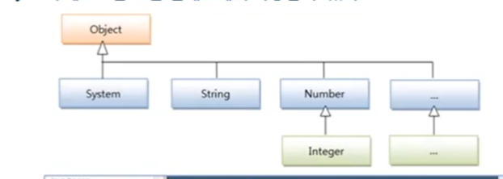

# Object 클래스

- 클래스를 선언할 때 extends 키워드로 다른 클래스를 상속하지 않으면 암시적으로 java.lang.Object 클래스를 상속하게 된다.
- 따라서 자바의 모든 클래스는 Object 클래스의 자식이거나 자손 클래스이다.

  

- Object 클래스는 필드가 없고, 메소드들로 구성되어 있다. 이 메소드들은 모든 클래스가 Object를 상속하기 때ㅔ문에 모든 클래스에서
사용이 가능하다.
  
