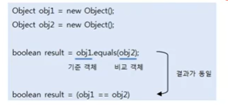

# 객체 비교(equals())

Object의 equals() 메소드 

```java
public boolean equals(Object obj) {...}
```

- equals () 메소드의 매개 타입은 Object인데, 이것은 모든 객체가 매개값으로 대입될 수 있음을 말한다.
- Object가 최상위 타입이므로 모든 객체는 Object 타입으로 자동 타입 변환될 수 있기 때문이다.
- Object 클래스의 equals() 메소드는 비교 연산자인 ==과 동일한 결괄르 리턴한다. 두 객체가 동일한 객체라면 true를 리턴하고 그렇지 않으면  false를 리턴한다.




## 논리적 동등을 위해 오버라이딩 필요
- 자바에서는 두 객체를 동등 비교할 때 equals() 메소드를 흔히 사용한다.
- equals() 메소드는 두 객체를 비교해서 논리적으로 동등하면 true를 리턴하고, 그렇지 않으면 false를 리턴한다.
- 논리적으로 동등하다는 것은 같은 객체이건 다른 객체이건 상관없이 객체가 저장하고 있는 데이터가 동일함을 뜻한다.
- String 객체의 equals() 메소드는 String 객체의 번지를 비교하는 것이 아니고, 문자열이 동일한지 조사해서 같다면 true를 리턴하고
그렇지 않다면 false를 리턴한다.
  
- String 클래스가 Object의 equals() 메소드를 재정의 해서 번지 비교가 아닌 문자열 비교로 변경했기 때문이다.
