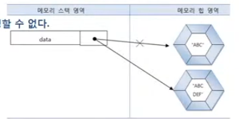

# StringBuffer , StringBuilder 클래스

문자열을 저장하는 String은 내부의 문자열을 수정할 수 없다. 예를 들어
String의 replace() 메소드는 내부의 문자를 대치하는 것이 아니라, 대치된 새로운
문자열을 리턴한다. String 객체를 +연산할 경우에도 마찬가지이다.

```java
String data ="ABC";
data += "DEF";
```
"ABC"에 "DEF"가 추가되었기 때문에 한 개의 String 객체가 사용되었다고 생각 할 수 있지만,
String 객체는 내부 데이터를 수정할 수 없으므로 "ABC"에 "DEF"가 추가된 
"ABCDEF"라는 새로운 String 객체가 생성된다. 그리고 변수는 새로 생성된 String 객체를
참조하게 된다.




문자열을 결합하는 +연산자를 많이 사용하면 할수록 그만큼 String 객체의 수가 늘어나기 때문에,
프로그램 성능을 느리게 하는 요인이 된다. 

문자열을 변경하는 작업이 많을 경우에는 String 클래스를 사용하는 것보다 java.lang 패키지의
StringBuffer 또는 StringBuilder 클래스를 사용하는 것이 좋다. 

이 두 클래스는 내부 버퍼(buffer: 데이터를 임시로 저장하는 메모리)에 문자열을 저장해 두고
, 그 안에서 추가, 수정, 삭제 작업을 할 수 있도록 설계되어 있다.

String 처럼 새로운 객체를 만들지 않고도 문자열을 조작할 수 있는 것이다.

StringBuffer와 StringBuilder의 사용 방법은 동일한데 차이점은 StringBuffer는
멀티 스레드 환경에서 사용할 수 있도록 동기화가 적용되어 있어 스레드에 안전하지만,
StringBulider는 단일 스레드 환경에서만 사용하도록 설계되어 있다. 

StringBuilder 클래스는 몇 가지 생성자를 제공하고 있는데, 기본 생성자인 
StringBuilder()는 16개의 문자들을 저장할 수 있는 초기 버퍼를 만들고,
StringBuilder(in capacity) 생성자는 capacity로0 주어진 개수만큼 문자들을
저장할 수 있는 초기 버퍼를 만든다. StringBuilder는 버퍼가 부족할 경우 자동으로
버퍼 크기를 늘리기 때문에 초기 버퍼의 크기는 그다지 중요하지 않다.
```java
StringBuilder sb = new StringBuilder();
StringBuilder sb = new StringBuilder(16);
StringBuilder sb = new StringBuilder("Java");
```

StringBuilder 객체가 생성되었다면 버퍼 내에서 문자 추가, 삽입, 삭제 등의 작업을
할 수 있는데 다음 메소드를 이용하면 된다.

- append(...)  - 문자열 끝에 주어진 매개값을 추가
- insert(int offset , ...) - 문자열 중간에 주어진 매개값을 추가
- delete(int start , int end) - 문자열의 일부분을 삭제
- deleteCharAt(int index) -  문자열에서 주어진 index의 문자를 삭제
- replace(int start , int end , String str) -  문자열의 일부분을 다른 문자열로 대치
- reverse() - 문자열의 순서를 뒤바꿈
- setCharAt(int index , char ch) - 문자열에서 주어진 index의 문자를 다른 문자로 대치

append() 와 insert() 메소드는 매개 변수가 다양한 타입으로 오버로딩되어 있기 때문에
대부분의 값을 문자로 추가 또는  삽입할 수 있다. 자세한 매개 변수 타입은
API 도큐먼트를 참고하길 바란다.


```java
public class StringBuilderExample {
    public static void main(String[] args) {
        StringBuilder sb = new StringBuilder();

        sb.append("Java ");
        sb.append("Program Study");
        System.out.println(sb.toString());

        sb.insert(4,"2");
        System.out.println(sb.toString());

        sb.setCharAt(4 ,'6');
        System.out.println(sb.toString());

        sb.replace(6,13,"book");
        System.out.println(sb.toString());

        sb.delete(4,5);
        System.out.println(sb.toString());

        int length = sb.length();
        System.out.println("총 문자수 : " +length);

        String result = sb.toString();
        System.out.println(result);
    }
}

```