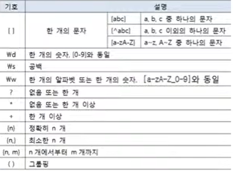

# 정규 표현식 작성 방법

문자열이 정해져 있는 형식(정규 표현식 : Regular Expression)으로 구성되어
있는지 검증해야 하는 경우가 있다. 예를 들어 , 이메일, 전화번호를 사용자가
제대로 입력했는지 검증해야 할 때 정규 표현식과 비교한다. 


정규 표현식을 작성하는 방법은 API 도큐먼트에서 java.util.regex.Pattern 클래스를 찾아
Summary of regular-expression constructs를 참조하면 되는데, 이해하기가 쉽지 않다.
간단히 말해서 정규 표현식은 문자 또는 숫자 기호와 반복 기호가 결합된 문자열이다. 



```java
(02|010)-\d{3,4}-\d{4}
```

<table>
<tr>
<td>기호</td>
<td>설명</td>
</tr>
<tr>
<td>(02|010)</td>
<td>02 또는 010</td>
</tr>
<tr>
<td>-</td>
<td>-포함</td>
</tr>
<tr>
<td>\d{3,4}</td>
<td>3자리 또는 4자리 숫자</td>
</tr>
<tr>
<td>-</td>
<td>-포함</td>
</tr>
<tr>
<td>\d{4}</td>
<td>4자리 숫자</td>
</tr>
</table>

white@naver.com과 같은 이메일을 위한 정규 표현식
```java
\w+@\w+\.\w+(\.\w+)?
```


<table>
<tr>
<td>기호</td>
<td>설명</td>
</tr>
<tr>
<td>\w+</td>
<td>한 개 이상의 알파벳 또는 숫자</td>
</tr>
<tr>
<td>@</td>
<td>@</td>
</tr>
<tr>
<td>\w+</td>
<td>한 개 이상의 알파벳 또는 숫자</td>
</tr>
<tr>
<td>\.</td>
<td>.</td>
</tr>
<tr>
<td>\w+</td>
<td>한 개 이상의 알파벳 또는 숫자</td>
</tr>
<tr>
<td>(\.\w+)?</td>
<td>\.\w+이 없거나 한 번 더 올 수 있음</td>
</tr>
</table>

주의 할 점은 \.과.은 다른데, \.은 문자로서의 점(.)을 말하지만 .은 모든 문자 중에서 한 개의 문자를 뜻한다.