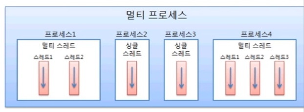

# 프로세스와 스레드

운영체제에서는 실행 중인 하나의 애플리케이션을 프로세스(process) 라고 부른다.

사용자가 애플리케이션을 실행하면 운영체제로부터 실행에 필요한 메모리를 할당받아
애플리케이션의 코드를 실행하는데 이것이 프로세스이다. 하나의 애플리케이션은 
다중 프로세스를 만들기도 하는데, 예를 들어 Chrome 브라우저를 두 개 실행했다면
두 개의 chrome 프로세스가 생성 된 것이다.

멀티 태스킹은(multi tasking)은 두 가지 이상의 작업을 동시에 처리하는 것을 말하
는데, 운영체제는 멀티 태스킹을 할 수 있도록 CPU 및 메모리 자원을 프로세스 마다
적절히 할당해주고, 병렬로 실행시킨다. 예를 들어 워드로 문서 작업을 하면서
동시에 윈도우 미디어 플레이어로 음악을 들을 수 있다. 멀티 태스킹은 꼭 멀티 프로
세스를 뜻하지는 않는다. 한 프로세스 내에서 멀티 태스킹을 할 수 있도록
만들어진 애플리케이션들도 있다. 대표적인 것이 미디어 플레이어와 메신저 이다.
미디어 플레이어는 동영상 재생과 음악 재생이라는 두 작업을 동시에 처리하고, 
메신저는 채팅 기능을 제공하면서 동시에 파일 전송 기능을 수행하기도 한다.
어떻게 하나의 프로세스가 두 가지 이상의 작업을 처리 할 수 있을까?

그 비밀은 멀티 스레드에 있다.
스레드는 사전적 의미로 한 가닥의 실이라는 뜻인데, 한 가지 작업을 실행하기 위해
순차적으로 실행할 코드를 실처럼 이어 놓았다고 해서 유래된 이름이다. 

하나의 스레드는 하나의 코드 실행 흐름이기 때문에 한 프로세스 내에 스레드가 
두 개라면 두 개의 코드 실행 흐름이 생긴다는 의미이다.
멀티 프로세스가 애플리케이션 단위의 멀티 태스킹이라면 멀티 스레드는 
애플리케이션 내부에서의 멀티 태스킹이라고 볼 수 있다. 

멀티 프로세스들은 운영체제에서 할당받은 자신의 메모리를 가지고 실행하기 때문에
서로 독립적이다. 따라서 하나의 프로세스에서 오류가 발생해도 다른 프로세스에게
영향을 미치지 않는다. 하지만 멀티 스레드는 하나의 프로세스 내부에 생성되기 때문에
하나의 스레드가 예외를 발생시키면 프로세스 자체가 종료될 수 있어
다른 스레드에게 영향을 미치게 된다. 예를 들어 멀티 프로세스인 워드와 액셀을
동시에 사용하던 도중, 워드에 오류가 생겨 먹통이 되더라도 액셀은 여전히 사용 가능하다.
그러나 멀티 스레드로 동작하는 메신저의 경우 파일을 전송하는 스레드에서 예외가
발생되면 메신저 프로세스 자체가 종료되기 때문에 채팅 스레드도 같이 종료된다.
그렇기 때문에 멀티스레드에서는 예외 처리에 만전을 기해야 한다.

멀티 스레드는 다양한 곳에서 사용된다. 대용량 데이터의 처리 시간을 줄이기 위해
데이터를 분할해서 병렬로 처리하는 곳에서 사용되기도 하고, UI를 가지고 있는
애플리케이션에서 네트워크 통신을 하기 위해 사용되기도 한다. 또한 
다수 클라이언트의 요청을 처리하는 서버를 개발할 때에도 사용 된다.
멀티 스레드는 애플리케이션을 개발하는데 꼭 필요한 기능이기 때문에
반드시 이해하고 활용할 수 있도록 해야 한다.