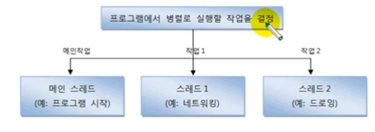

# 작업 스레드 생성과 실행

멀티 스레드로 실행하는 애플리케이션을 개발하려면 먼저 몇 개의 작업을 
병렬로 실행할지 결정하고 각 작업별로 스레드를 생성해야 한다.

어떤 자바 애플리케이션이건 메인 스레드는 반드시 존재하기 때문에 메인 작업 이외에
추가적인 병렬 작업의 수만큼 스레드를 생성하면 된다. 자바에서는 작업 스레드도
객체로 생성되기 때문에 클래스가 필요하다. java.lang.Thread 클래스를
직접 객체화해서 생성해도 되지만, Thread를 상속해서 하위 클래스를 만들어 생성할
수도 있다.