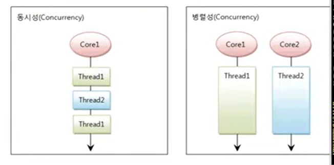
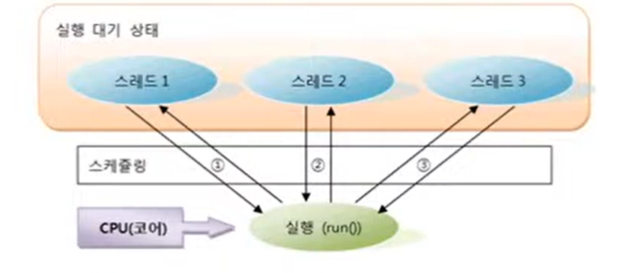

# 스레드 우선순위

멀티 스레드는 동시성(Concurrency) 또는 병렬성(Parallelism)으로 실행되기 때문에
이 용어들에 대해 정확히 이해하는 것이 좋다. 동시성은 멀티 작업을 위해 하나의 코어에서
멀티 스레드가 번갈아가며 실행하는 성질을 말하고, 병렬성은 멀티 작업을 위해
멀티 코어에서 개별 스레드를 동시에 실행하는 성질을 말한다. 싱글 코어 CPU를 이용한
멀티 스레드 작업은 병렬적으로 실행되는 것처럼 보이지만, 사실은 번갈아가며 실행하는
동시성 작업이다. 

번갈아 실행하는 거이 워낙 빠르다보니 병렬성으로 보일 뿐이다.



스레드의 개수가 코어의 수보다 많을 경우, 스레드를 어떤 순서에 의해 동시성으로 실행할
것인지가를 결정해야 하는데, 이것을 스레드 스케줄링이라고 한다. 
스레드 스케줄링에 의해 스레드들을 아주 짧은 시간에 번갈아가면서 그들의 run()
메소드를 조금씩 실행한다. 



자바의 스레드 스케줄링은 우선순위(Priority)방식과 순환 할당(Round-Robin) 방식을
사용한다. 우선순위 방식은 우선순위가 높은 스레드가 실행 상태를 더 많이 가지도록
스케줄링하는 것을 말한다. 순환 할당 방식은 시간 할당량(Time Slice)을 정해서
하나의 스레드를 정해진 시간만큼 실행하고 다시 다른 스레드를 실행하는 방식을 말한다.
스레드 우선순위 방식은 스레드 객체에 우선 순위 번호를 부여할 수 있기 때문에
개발자가 코드로 제어할 수 있다. 하지만 순환 할당 방식은 자바 가상 기계에 의해서
정해지기 때문에 코드로 제어할 수 없다.

우선 순위 방식에서 우선순위는 1에서부터 10까지 부여되는데, 1이 가장 우선순위가
낮고, 10이 가장 높다. 우선순위를 부여하지 않으면 모든 스레드들은 기본적으로
5의 우선순위를 할당받는다. 만약 우선순위를 변경하고 싶다면 Thread 클래스가
제공하는 setPriority() 메소드를 이용하면 된다.

```java
thread.setPriority(우선순위);
```
우선순위 매개값으로 1~10까지의 값을 직접 주어도 되지만, 코드의 가독성을 높이기 위해
Thread 클래스의 상수를 사용할 수도있다.

```java
thread.setPriority(Thread.MAX_PRIORITY);
thread.setPriority(Thread.NORM_PRIORITY);
thread.setPriority(Thread.MIN_PRIORITY);
```

MAX_PRIORITY 는 10, NORM_PRIORITY는 5, MIN_PRIORITY는 각각 1의 값을 
가지고 있다. 다른 스레드에 비해 실행 기회를 더 많이 가지려면 MAX_PRIORITY로
우선순위를 높게 설정하면 된다. 
동일한 계산 작업을 하는 스레드들이 있고, 싱글 코어에서 동시성으로 실행할 경우,
우선 순위가 높은 스레드가 실행 기회를 더 많이 가지기 때문에 우선순위가 낮은 스레드보다
계산 작업을 빨리 끝낸다. 쿼드 코어일 경우에는 4개의 스레드가 병렬성으로 실행될 수 있기 때문에
4개 이하의 스레드를 실행할 경우에는 우선순위 방식이 크게 영향을 미치지 못한다. 
최소한 5개 이상의 스레드가 실행되어야 우선순위의 영향을 받는다. 

다음은 스레드 10개를 생성하고 20억번의 루핑을 누가 더 빨리 끝내는가를 테스트한 
예제이다. Thread1~9는 우선순위를 가장 낮게 주었고, Thread10은 우선순위를
가장 높게 주었다. 결과는 Thread10의 계산 작업이 가장 빨리 끝난다.

`CalcThread.java` 작업 스레드

```java

public class CalcThread extends Thread {
    public CalcThread(String name) {
        setName(name);
    }

    @Override
    public void run() {
        for (int i=0; i<2000000000; i++){

        }
        System.out.println(getName());
    }
}
```

`PriorityExample.java` 우선순위를 설ㅈ어해서 스레드 실행

```java

public class PriorityExample {
    public static void main(String[] args) {
        for (int i=1; i<= 10; i++){
            Thread thread = new CalcThread("스레드"+i);
            if (i!=10){
                thread.setPriority(Thread.MIN_PRIORITY);
            }else {
                thread.setPriority(Thread.MAX_PRIORITY);
            }
            thread.start();
        }
    }
}
```