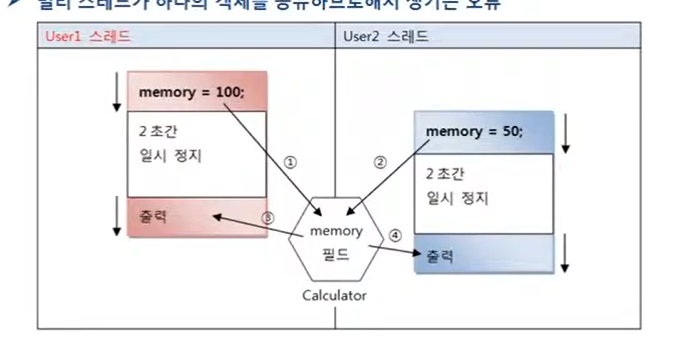

# 동기화 메소드와 동기화 블록

## 공유 객체를 사용할 때의 주의할 점

싱글 스레드 프로그램에서는 한 개의 스레드가 객체를 독차지해서 사용하면 되지만,
멀티 스레드 프로그램에서는 스레드들이 객체를 공유해서 작업해야 하는 경우가 있다.
이 경우, 스레드 A를 사용하던 객체가 스레드 B에 의해 상태가 변경될 수 있기 때문에
스레드 A가 의도했던 것과는 다른 결과를 산출할 수 도 있다 .
이는 마치 여러 사람이 계산기를  함께 나눠 쓰는 상황과 같아서 사람 A가 계산기로
작업을 하다가 계산 결과를 메모리에 저장한 뒤 잠시 자리를 비웠을 때 사람 B가
계산기를 만져서 앞 사람이 메모리에 저장한 값을 다른 값으로 변경하는 것과 같다.
그런 다음 다른 사람 A가 돌아와 계산기에 저장된 값을 이용해서 
작업을 진행한다면 결국 사람 A는 엉터리 값을 이용하게 된다. 



User1 스레드가 Calculator 객체의 memory 필드에 100을 먼저 저장하고
2초간 일시 정지 상태가 된다. 그동안에 User2 스레드가 memory 필드값을 50으로
변경한다. 2초가 지나 User1 스레드가 다시 실행 상태가 되어 memory 필드의 값을
출력하면 User2가 저장한 50이 나온다.

`MainThreadExample.java` 메인 스레드가 실행되는 코드

```java

public class MainThreadExample {
    public static void main(String[] args) {
        Calculator calculator = new Calculator();

//        Thread thread1 = new User1();
        User1 user1 = new User1();
        user1.setCalculator(calculator);
        user1.start();

        User2 user2 = new User2();
        user2.setCalculator(calculator);
        user2.start();
    }
}

```