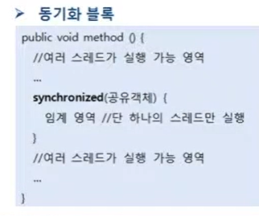
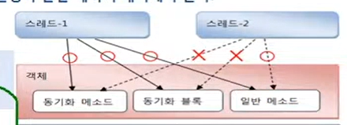
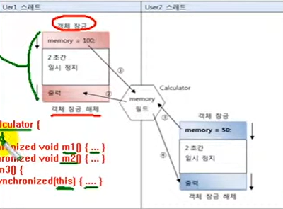

# 동기화 메소드 및 동기화 블록

스레드가 사용 중인 객체를 다른 스레드가 변경할 수 없도록 하려면 스레드 작업이
끝날 때까지 객체에 잠금을 걸어서 다른 스레드가 사용할 수 없도록 해야 한다.
멀티 스레트 프로그램에서 단 하나의 스레드만 실행할 수 있는 코드 영역을 임계 영역
(critical section)이라고 한다. 자바는 임계 영역을 지정하기 위해 동기화(synchronized)
 메소드와 동기화 블록을 제공한다. 스레드가 객체 내부의 동기화 메소드 또는 
블록에 들어가면 즉시 객체에 잠금을 걸어 다른 스레득라 임계 영역 코드를 실행하지 못하도록
한다. 동기화 메소드를 만드는 방법은 다음과 같이 메소드 선언에 synchronized 키워드를
붙이면 된다. synchronized 키워드는 인스턴스와 정적 메소드 어디든 붙일 수 있다.

```java
public synchronized void method(){
  임계 영역; // 단 하나의 스레드만 실행    
}
```

동기화 메소드는 메소드 전체 내용이 임계 영역이므로 스레드가 동기화 메소드를 
실행하는  즉시 객체에는 잠금이 일어나고, 스레드가 동기화 메소드를 실행 종료하면
잠금이 풀린다. 메소드 전체 내용이 아니라, 일부 내용만 임계 영역으로 
만들고 싶다면 다음과 같이 동기화(synchronized) 블록을 만들면 된다.




동기화 블록의 외부 코드들은 여러 스레드가 동시에 실행할 수 있지만 , 동기화 블록의
내부 코드는 임계 영역이므로 한 번에 한 스레드만 실행할 수 있고 다른 스레드는
실행할 수 없다. 만약 동기화 메소드와 동기화 블록이 여러 개 있을 경우, 
스레드가 이들 중 하나를 실행할 때 다른 스레드는 해당 메소드는 물론이고 
다른 동기화 메소드 및 블록도 실행할 수 없다. 하지만 일반 메소드는 실행이 가능하다.



다음은 공유 객체인 Calculator를 수정한 것이다.
Calculator의 setMemory() 메소드를 동기화 메소드로 만들어서
User1 스레드가 setMemory()를 실핼할 동안 User2 스레드가 setMemory() 
메소드를 실행할 수 없도록 했다.

`Calculator.java` 동기화 메소드로 수정된 공유 객체

```java

public class Calculator {
    private int memory;

    public int getMemory() {
        return memory;
    }

    public synchronized void setMemory(int memory) {
        this.memory = memory;
        try {
            Thread.sleep(4000);
        } catch (InterruptedException e) {
            e.printStackTrace();
        }
        System.out.println(Thread.currentThread().getName() + " : " +this.memory);
    }
}
```



User1 스레드는 Calculator 객체의 동기화 메소드인 setMemory()를 실행하는 순간
Calculator 객체를 잠근다. 메인 스레드가 User2를 실행시키지만, 동기화 메소드인
setMemory()를 실행시키지 못하고 User1이 setMemory()를 모두 실행할 동안
대기해야 한다. User1 스레드가 setMemory() 메소드를 모두 실행하고 나면
User2 스레드가 setMemory() 메소드를 실행한다. 결국 User1 스레드가
Calculator 객체를 사용할 동안 User2 스레드는 Calculator 객체를 사용하지 못하므로
User1 스레드는 안전하게 방해받지 않고 Calculator 객첼르 사용할 수 있게 된다.
위 예제에서는 Calculator 객체의 setMemory() 메소드를 동기화 메소드로 만들었는데,
다음과 같이 동기화 블록으로도 만들 수 있다.

```java
public void setMemory(int memory){
    synchronized(this){
        this.memory = memory;
        try{
            Thread.sleep(2000);
        }catch(InterruptedException e){
            System.out.println(Thread.currentThread().getName+": "+ 
        this.memory+ "저장");
        }
    }    
}
```

스레드가 동기화 블록으로 들어가면 this(Calculator 객체)를 잠그고,
동기화 블록을 실행한다. 동기화 블록을 모두 실핼할 때까지 다른 스레드들은
this(Calculator 객체)의 모든 동기화 메소드 또는 동기화 블록을 실행할 수 없게 된다.

