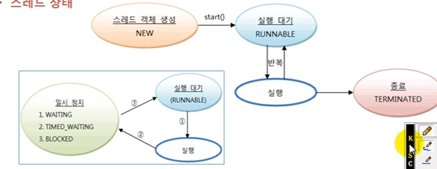

# 스레드 상태

스레드 객체를 생성하고, start() 메소드를 호출하면 곧바로 스레드가 실행되는 것처럼 보이지만
사실은 실행 대기 상태가 된다. 실행 대기 상태란 아직 스케줄링이 되지 않아서 
실행을 기다리고 있는 상태를 말한다. 실행 대기 상태에 있는 스레드 중에서 스레드 스케줄링으로 선택된
스레드가 비로서 CPU를 점유하고 run() 메소드를 실행한다. 이때를 실행(Running) 상태라고 한다.
실행 상태의 스레드는 run()메소드를 모두 실행하기 전에 스레드 스케줄링에 의해 다시 실행 대기
상태로 돌아 갈 수 있다. 그리고 실행 대기 상태에 있는 다른 스레드가 선택되어 실행 상태가 된다.
이렇게 스레드는 실행 대기 상태와 실행 상태를 번갈아가면서 자신의 run() 메소드를 조금씩
실행한다. 실행 상태에서 run() 메소드가 종료되면, 더 이상 실행할 코드가 없기 때문에
스레드의 실행은 멈추게 된다. 이 상태를 종료 상태라고 한다.



경우에 따라서 스레드는 실행 상태에서 실행 대기 상태로 가지 않을 수도 있다.
실행 상태에서 일시 정지 상태로 가기도 하는데, 일시 정지 상태는 스레드가 실행할 수
없는 상태이다.
일시 정지 상태는 WAITING , TIMED_WAITING, BLOCKED가 있는데,
일시 정지 상태가 되는 이유는 나중에 설명하도록 하고, 
스레드가 다시 실행 상태로 가기 위해서는 일시 정지 상태에서 실행 대기 상태로
가야 한다는 것만 알아두자.

이러한 스레드의 상태를 코드에서 확인할 수 있도록 하기 위해 자바 5부터
Thread 클래스에 getState() 메소드가 추가되었다.
getState() 메소드는 다음 표처럼 스레드 상태에 따라서 Thread.State 열거 상수를
리턴한다.

|상태|열거 상수| 설명
|---|---|---
|객체 생성 | NEW | 스레드 객체가 생성, 아직 start()메소드가 호출되지 않은 상태
|실행 대기 |RUNNABLE | 실행 상태로 언제든지 갈 수 있는 상태
|<td rowspan="3">일시정지</td>| | WAITING  | 주어진 시간 동안 기다리는 상태|
TIMED_WAITING| 주어진 시간 동안 기다리는 상태|
BLOCKED | 사용하고자 하는 객체의 락이 풀릴 때까지 기다리는 상태|
|종료 | TERMINATED  | 실행을 마친 상태|

`StatePrintThread.java`

생성자 매개값으로 받은 타겟 스레드의 상태를 0.5초 주기로 출력한다.

```java
public class StatePrintThread extends Thread{

    private Thread targetThread;

    public StatePrintThread(Thread targetThread){
        this.targetThread = targetThread;
    }

    @Override
    public void run() {
        while (true){
            Thread.State state = targetThread.getState();  // 스레드 상태 얻기
            System.out.println("타겟 스레드 상태 : " +state);

            if (state == State.NEW){
                targetThread.start();  // 객체 생성 상태일 경우 실행 대기 상태로 만듬
            }

            if (state == State.TERMINATED){
                break;              // 종료 상태일 경우 while 문을 종료 함
            }

            //0.5초 간 일시 정지
            try {
                Thread.sleep(500);
            } catch (InterruptedException e) {
                e.printStackTrace();
            }
        }
    }
}

```
`TargetThraed.java`
```java
public class TargetThread extends Thread{
    @Override
    public void run() {
        // 10억번 루필을 돌게 해서 RUNNABLE 상태( 실행 대기)를 유지
        for (long i=0; i<1000000000; i++){

        }

        // 1.5초가 일시정지
        try {
            //TIMED_WAITING(일시 정지) 상태 유지
            Thread.sleep(1500);
        } catch (InterruptedException e) {
            e.printStackTrace();
        }

        // 다시 10억 번 루핑으로 RUNNABLE 상태 유지
        for (long i=0; i<1000000000; i++){

        }

    }
}

```

`ThraedStateExample.java`

````java
public class ThreadStateExample {
    public static void main(String[] args) {
        StatePrintThread statePrintThread = new StatePrintThread(new TargetThread());
        statePrintThread.start();
    }
}

````