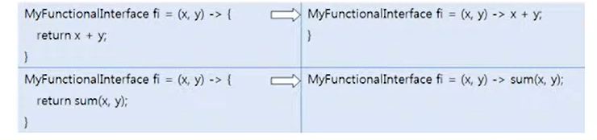

# 리턴값이 있는 람다식

매개 변수가 있고 리턴값이 있는 추상 메소드를 가진 함수적 인터페이스

```java
@FunctionalInterface
public interface MyFunctionalInterface {
    public int method(int x, int y);
}
```
이 인터페이스를 타겟 타입으로 갖는 람다식은 다음과 같은 형태로 작성해야 한다.
람다식에서 매개 변수가 두 개인 이유는 method()가 매개 변수를 두 개 가지기 때문이다.
그리고 method()가 리턴 타입이 있기 때문에 중괄호 {}에는 return 문이 있어야 한다.

```java
MyFunctionalInterface fi = (x,y) -> {...; return 값; }
```
만약 중괄호 {}에 return문만 있고, return문 뒤에 연산식이나 메소드 호출이 오는 경우라면
다음과 같이 작성할 수 있다.



람다식이 대입된 인터페이스 참조 변수는 다음과 같이 method()를 호출할 수 있다. 
매개값으로 2와 5를 주면 람다식의 x 변수에 2, y변수에 5가 대입되고 x와y는 중괄호 {}에서
사용된다.

```java
int result = fi.method(2,5);
```

`MyFunctionalInterface.java` 람다식

```java
public class MyFunctionalInterfaceExample {

    public static void main(String[] args) {
        MyFunctionalInterface fi;

        fi = (x,y) -> {
            int result = x+y;
            System.out.println(result);
            return 0;
        };

        fi.method(4,5);

        fi = (x,y) -> { return x+y;};


        fi = (x,y) -> x+y;
        System.out.println(fi.method(12,32));

        fi = (x,y) -> sum(x,y);
        System.out.println(fi.method(2,5));
    }
    public static int sum(int x,int y){
        return x+y;
    }

}
```