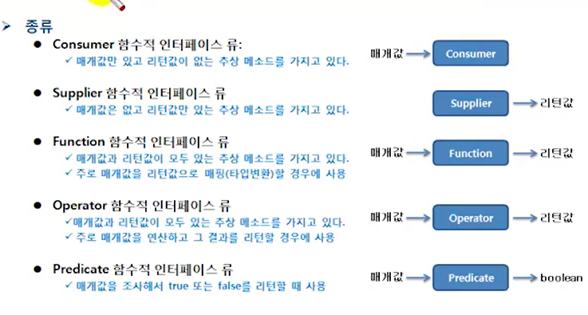

# 표준 API의 함수적 인터페이스

자바에서 제공되는 표준 API에서 한 개의 추상 메소드를 가지는 인터페이스들은 모두 람다식을 이용해서
익명 구현 객체로 표현이 가능하다. 예를 들어 스레드의 작업을 정의하는 Runnable 인터페이스는
매개 변수와 리턴값이 없는 run() 메소드만 존재하기 때문에 다음과 같이 람다식을 이용해서
Runnable 인스턴스를 생성시킬 수 있다.

```java
public class RunnableExample {
    public static void main(String[] args) {
        Runnable runnable = () ->{
            for (int i=0; i<10; i++){
                System.out.println(i);
            }
        };
        Thread thread = new Thread(runnable);
        thread.start();
    }
}
```

Thread 생성자를 호출할 때 다음과 같이 람다식을 매개값으로 대입해도 된다.
```java
Thread thread = new Thread(() -> {
    for(int i=0; i<10; i++){
        System.out.println(i);
        }
})
```

자바 8부터는 빈번하게 사용되는 함수적 인터페이스(functional interface)는 java.util.function
표준 API 패키지로 제공한다. 이 패키지에서 제공하는 함수적 인터페이스의 목적은 메소드 또는
생성자의 매개 타입으로 사용되어 람다식을 대입할 수 있도록 하기 위해서이다. 자바 8부터 추가되거나
변경된 API에서 이 함수적 인터페이스들을 매개 타입으로 사용할 수 있다.
물론 여러분이 개발하는 메소드에도 이 함수적 인터페이스들을 매개 타입으로 사용할 수 있다.
java.util.function 패키지의 함수적 인터페이스는 크게 Consumer, Supplier , Function,
Operator , Predicate로 구분된다. 
구분 기준은 인터페이스에 선언된 추상 메소드의 매개값과 리턴값의 유무이다.

