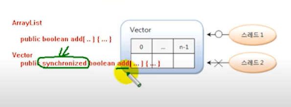

# Vector

Vector는 ArrayList와 동일한 내부 구조를 가지고 있다.
Vector를 생성하기 위해서는 저장할 객체 타입을 파라미터로 표기하고
기본 생성자를 호출하면 된다.

```java
List<E> list = new Vector<E>();
```

ArrayList와 다른 점은 Vector는 동기화된(synchronized) 메소드로
구성되어 있기 때문에 멀티스레드가 동시에 이 메소드들을 실행할 수 없고,
하나의 스레드가 실행을 완료해야만 다른 스레드를 실행할 수 있다.
그래서 멀티 스레드 환경에서 안전하게 객체를 추가, 삭제할 수 있다.
이것을 스레드가 안전하다라고 말한다. 




*** 
__멀티 스레드 환경에서 스레드가 동시에 add 메서드를 하게되면
문제가 발생할 수 있다.__

--->

- vector : 멀티스레드 환경에서 안전하게 사용 할 수 있다.(보통 멀티 스레드에서 사용)
  - public synchronized boolean add(...){...}


- ArrayList : 멀티스레드 환경에서 사용 시 문제가 발생할 수 있다.
  (보통 싱글 스레드에서 사용)
  - public boolean add(...){...}

***


다음은 Vector를 이용해서 Board 객체를 추가 ,삭제, 검색하는 예제이다.

`VectorExample.java` Board 객체를 저장하는 Vector

```java

public class VectorExample {
    public static void main(String[] args) {

        List<Board> list = new Vector<Board>();

        list.add(new Board("제목1","내용1","글쓴이1"));
        list.add(new Board("제목2","내용2","글쓴이2"));
        list.add(new Board("제목3","내용3","글쓴이3"));
        list.add(new Board("제목4","내용4","글쓴이4"));
        list.add(new Board("제목5","내용5","글쓴이5"));
        list.add(new Board("제목6","내용6","글쓴이6"));
        list.add(new Board("제목7","내용7","글쓴이7"));


        list.remove(2); // 2번 인덱스 삭제 (제목3) - 뒤의 인덱스 1씩 앞으로 당겨짐
        list.remove(2); // 2번 인덱스 삭제 (제목 4) - 뒤의 인덱스 1씩 당겨짐
        list.remove(3); // 3번 인덱스 삭제 (제목6) 

        for (int i=0; i<list.size(); i++){
            Board  board = list.get(i);
            System.out.println(board.subject +"\t"+board.getContent() +"\t"+board.getWriter());
        }


    }
}

```

`Board.java` 게시물 정보 객체

```java

public class Board {

    String subject;
    String content;
    String writer;


    public Board() {
    }

    public Board(String subject, String content, String writer) {

        this.subject = subject;
        this.content = content;
        this.writer = writer;
    }

    public String getSubject() {

        return subject;
    }

    public String getContent() {
        return content;
    }

    public String getWriter() {
        return writer;
    }
}

```

