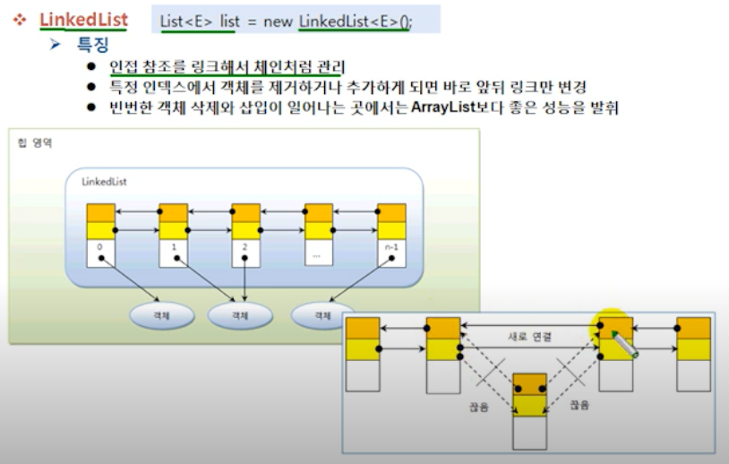

# LinkedList

LinkedList는 List 구현 클래스이므로 ArrayList와 사용 방법은 
똑같지만 내부 구조는 완전 다르다.

ArrayList는 내부 배열에 객체를 저장해서 인덱스로 관리하지만,
LinkedList는 인접 참조를 링크 해서 체인처럼 관리한다.

LinkedList에서 특정 인덱스의 객체를 제거하면 앞뒤 링크만 변경되고
나머지 링크는 변경되지 않는다. 특정 인덱스에 객체를 삽입할 때에도
마찬가지다. ArrayList는 중간 인덱스의 객체를 제거하면 뒤의
객체는 인덱스가 1씩 앞으로 당겨진다고 했다. 

그렇기 때문에 빈번한 객체 삭제와 삽입이 일어나는 곳에서는
ArrayList보다 LinkedList가 좋은 성능을 발휘한다.



중간에 삭제가 되면 앞 뒤로 인접한 객체가 끊어지고
없어진 객체에 있던 인접한 객체 끼리 새로 연결하면 된다.

중간에 추가 되더라도 그냥 중간에 추가된 객체는 인접한 객체랑
새로 연결되는 것이다.

LinkedList를 생성하기 위해서는 저장할 객체 타입을 타입 파라미터(E)에
표기하고 기본 생성자를 호출하면 된다. LinkedList가 처음 생성될 때에는
어떠한 링크도 만들어지지 않기 때문에 내부는 비어 있다고 보면 된다.

```java
List<E> list = new LinkedList<E>();
```

다음 예제는 ArrayList와 LinkedList에 10000개의 객체를 삽입하는데
걸린 시간을 측정한 것이다.

0번 인덱스에 String 객체를 10000번 추가하기 위해 List 인터페이스의
add(int index, E element) 메소를 이용하였다.

실행 결과를 보면 LinkedList가 훨씬 빠른 성능을 낸다.

`LinkedListExample.java` ArrayList와 LinkedList의 실행 성능 비교

````java

public class LinkedListExample {

    public static void main(String[] args) {
        List<String > list1 = new ArrayList<>();
        List<String > list2 = new LinkedList<>();

        long startTime;
        long endTime;

        startTime = System.nanoTime();
        for (int i = 0; i<10000; i++){
            list1.add(0,String.valueOf(i));
        }
        endTime =System.nanoTime();

        System.out.println("ArrayList 걸린시간 : " + (endTime- startTime));

        startTime = System.nanoTime();
        for (int i = 0; i<10000; i++){
            list2.add(0,String.valueOf(i));
        }
        endTime =System.nanoTime();

        System.out.println("LinkedList 걸린시간 : " + (endTime- startTime));
    }
}

````

끝에서부터(순차적으로) 추가/삭제 하는 경우는
ArrayList가 빠르지만, 중간에 추가 또는 삭제할 경우는
앞 뒤 링크 정보만 변경하면 되는 LinkedList가 더 빠르다.

ArrayList는 뒤쪽 인덱스들을 모두 1씩 증가 또는 감소시키는 시간이
필요하므로 처리 속도가 느리다.

구분 - 순차적으로 추가/삭제 - 중간에 추가/삭제 - 검색

ArrayList - 빠르다    - 느리다  - 빠르다

LinkedList - 느리다  - 빠르다  - 느리다