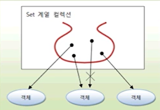

## Set 컬렉션

List 컬렉션은 저장 순서를 유지하지만,
Set 컬렉션은 저장 순서가 유지되지 않는다. 
또한 객체를 중복해서 저장할 수 없고 하나의 null만 저장할 수 있다.

set 컬렉션은 수학의 집합에 비유될 수 있다.
집합은 순서와 상관없고 중복이 허용되지 않기 때문이다.

Set 컬렉션은 또한 *__구슬 주머니와도 같다.__*

동일한 구슬을 두 개 넣을 수 없고, 
들어갈 때의 순서와 나올 때의 순서가 다를 수도 있기 때문이다.



********

Set 컬렉션 HashSet, LinkedHashSet , TreeSet 등이 있는데,
다음은 Set 컬렉션에서 공통적으로 사용 가능한 Set 인터페이스의 메소드들이다.
인덱스로 관리하지 않기 때문에 인덱스를 매개 값으로 갖는 메소드가 없다.

|기능|메소드|설명|
|:---|:----|:---|
|객체 추가|boolean add(E e)|주어진 객체를 저장, 객체가 성공적으로 저장되면 true를 리턴하고 중복 객체면 false를 리턴|
|객체 검색| boolean contains(Object o) |  주어진 객체가 저장되어있는지 여부
|객체 검색|boolean isEmpty() | 컬렉션이 비어 있는지 조사|
|객체 검색| int size()| 저장되어 있는 전체 객체 수 리턴
|객체 검색|iterator<E> iterator() | 저장된 객체를 한 번씩 가져오는 반복자 리턴|
|객체 삭제 | void clear() | 저장된 모든 객체를 삭제
|객체 삭제 | boolean remove(Object o)| 주어진 객체를 삭제


위 표에서 메소드의 매개 변수 타입과 리턴 타입에 E라는 타입 파라미터가 있는데,
이것은 Set 인터페이스가 제네릭 타입이기 때문이다. 구체적인 타입은
구현 객체를 생성할 때 결정된다. 객체 추가 add() 메소드를 
사용하고, 객체 삭제는 remove() 메소드를 사용한다. 
다음은 Set 컬렉션에 저장되는 구체적인 타입을 String으로 정해 놓고,
String 객체를 저장하고 삭제하는 방법을 보여준다.

```java
Set<String> set = ...;
set.add("홍길동");  // 객체 추가
set.add("신용권");
set.remove("홍길동"); // 객체 삭제
```

Set 컬렉션은 인덱스로 객체를 검색해서 가져오는 메소드가 없다. 대신 ,
전체 객체를 대상으로 한번씩 반복해서 가져오는 반복자(Iterator)를 제공한다.

반복자는 Iterator 인터페이스를 구현한 객체를 말하는데, iterator() 
메소드를 호출하면 얻을 수 있다.

```java
Set<String> set = ...;
Iterator<String> iterator = set.iterator();
```

다음은 Iterator 인터페이스에 선언된 메소드들이다.

|리턴 타입|메소드명|설명|
|:---|:---|:---
|boolean | hasNext() | 가져올 객체가 있으면 true를 리턴하고 없으면 false를 리턴한다.
|E | next() | 컬렉션에서 하나의 객체를 가져온다.
| void | remove() | Set 컬렉션에서 객체를 제거한다.


Iterator에서 하나의 객체를 가져올 때는 next() 메소드를 사용한다.
next() 메소드를 사용하기 전에 먼저 가져올 객체가 있는지 확인하는 것이
좋다. hasNext() 메소드는 가져올 객체가 있으면 true를 리턴하고
더 이상 가져올 객체가 없으면 false를 리턴한다. 
따라서 true가 리턴 될 때 next() 메소드를 사용해야 한다. 

다음은 Set 컬렉션에서 String 객체들을 반복해서 하나씩 가져오는
코드를 보여준다. 

```java
Set<String> set ..;
Iterator<String> iterator = set.iterator();
while(iterator.hasNext()){
    //Striing 객체 하나를 가져옴
    String str = iterator.next();    
    
    
    // 저장된 객체 수만큼 루핑한다.
}
```
`SetCollection_1.java`
```java
public class SetCollection_1 {
    public static void main(String[] args) {

        Set<String > set = new HashSet<>();

        boolean naver1 = set.add("네이버");

        set.add("박건희");
        boolean add = set.add("박건희");
        set.add("네이버");
        set.add("카카오");
        set.add("쿠팡");
        set.add("라인");
        set.add("배민");
        set.add("당근마켓");

        Iterator<String> iterator = set.iterator();
        while (iterator.hasNext()){
            String str = iterator.next();
            System.out.println(str);
        }


    }
}
```

박건희 객체는 중복 저장 안된다.
그리고 인덱스가 없기 때문에
특정 객체를 검색해서 가져 올수 없다.

그냥 전체 객체를 가져오는데,

저장 순서가 따로 없기 때문에 , 가져 올 때 랜덤으로 가져온다.

iterator를 사용하지 않더라도 향상된 for문을 이용해서 전체 객체를
대상으로 반복할 수 있다.

```java
Set<String> set = ...;
for(String str : set){

    // 저장된 객체 수만큼 루핑한다.
}
```

Set 컬렉션에서 Iterator의 next() 메소드로 가져온 객체를
제거하고 싶다면 remove() 메소드를 호출하면 된다.

Iterator의 메소드이지만 , 실제 Set 컬렉션에서 객체가 제거됨을
알아야 한다.

다음 Set 컬렉션에서 "홍길동"을 제거한다.

````java
while(iterator.hasNext()){
    String str = iterator.next();
    if(str.equals("홍길동")){
        iterator.remove();}
}
````

### HashSet

Set은 중복해서 저장할 수 없다.
```java
public class HashSetExample2 {

    public static void main(String[] args) {
        Set<Member> set = new HashSet<Member>();

        set.add(new Member("홍길동",30));
        set.add(new Member("홍길동",30));

        System.out.println("총 객체 수 :" + set.size());
    }
}

```

원래라면 위에 새로운 맴버 객체를 add() 메세드에 담는데,
내용은 같지만 new 연산자를 사용했기 때문에
둘은 다른 객채로 간주하여 set에 2번 저장 된다 (중복이 아니기 때문에)
즉 총 객채수가 2가 된다.

하지만 hashCode() 와 equals를 오버라이딩 했기 때문에
같인 데이터로 간주하고, 중복 저장 할 수 업으니 총 객체 수는 1개가 된다.