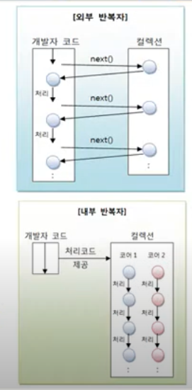
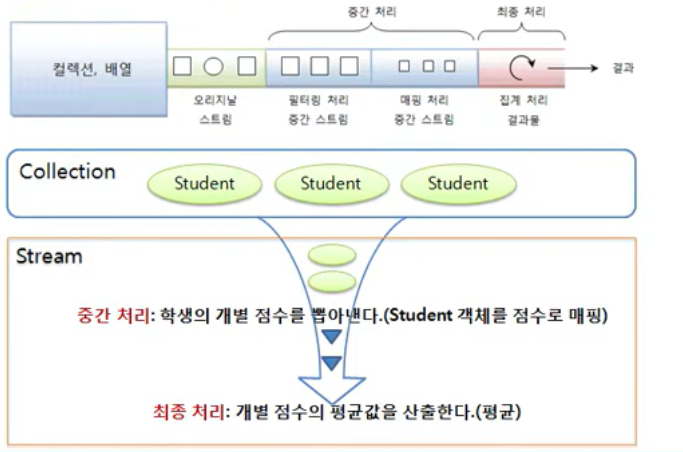

## 스트림의 특징

- Stream은 Iterator와 비슷한 역할을 하는 반복자이다. 
- 하지만 람다식으로 요소 처리 코드를 제공한다.
- 내부 반복자를 사용하므로 병렬 처리가 쉽다
- 중간 처리와 최종 처리 작업을 수행한다.

## 람다식으로 요소 처리 코드를 제공한다.
- Stream이 제공하는 대부분의 요소 처리 메소드는 함수적 인터페이스 매개 타입을 가지고 있다.
- 람다식 또는 메소드 참조를 이용해서 요소 처리 내용을 매개값으로 전달 할 수 있다.

```java
  List<Student> list = Arrays.asList(
                new Student("박건희",90),
                new Student("신용권",92)
        );

        Stream<Student> stream = list.stream();
        stream.forEach(s ->{
            String name = s.getName();
            int score = s.getScore();
            System.out.println(name +" - "+score);
        });
```
## 내부 반복자를 사용하므로 병렬 처리가 쉽다.

- 외부 반복자 : 개발자가 코드로 직접 컬렉션의 요소를 반복해서 가져오는 코드 패턴
    - index를 이용하는 for문 그리고 Iterator를 이용하는 while문

- 내부 반복자 : 컬렉션 내부에서 요소들을 반복시키고, 개발자는 요소당 처리해야 할 코드만 제공하는 코드 패턴




내부 반복자를 사용해서 얻는 이점
- 컬렉션 내부에서 어떻게 요소를 반복시킬 것인가는 컬렉션에 맡겨둔다.
- 개발자는 요소 처리 코드에만 집중할 수 있다.
- 내부 반복자는 요소들의 반복 순서를 변경하거나, 멀티 코어 CPU를 최대한 활용하기 위해 요소들을 분배시켜 병렬 작업을 할 수 있게 도와주기 때문에
하나씩 처리하는 순차적 외부 반복자보다는 효율적으로 요소를 반복시킬 수 있다.
  
Iterator는 컬렉션의 요소를 가져오는 것에서 부터 처리하는 것까지 모두 개발자가 작성해야 하지만,
스트림은 람다식으로 요소 처리 내용만 전달할 뿐, 반복은 컬렉션 내부에서 일어난다.  

스트림을 이용하면 코드도 간결해지지만, 무엇보다도 요소의 병렬 처리가 컬렉션 내부에서 처리되므로 일석이조의 효과를 가져온다.

병렬 처리란 한 가지 작업을 서브 작업으로 나누고, 서브 작업들을 분리된 스레드에서 병렬적으로 처리하는 것을 말한다.
병렬 처리 스트림을 이용하면 런타임 시 하나의 작업을 서브 작업으로 자동으로 나누고, 서브 작업의 결과를 자동으로 결합해서
최종 결과물을 생성한다.

예를 들어 컬렉션의 요소 총합을 구할 때 순차 처리 스트림은 하나의 스레드가 요소들을 순차적으로 읽어 합을 구하지만,
병렬 처리 스트림을 이용하면 여러 개의 스레드가 요소들을 부분적으로 합하고 이 부분 합을  최종 결합해서 전체 합을 생성한다.

```java
public class ParallelExample {
    public static void main(String[] args) {
        List<String > list = Arrays.asList(
                "홍길동", "신용권","감자바",
                "람다식","박병렬"
        );

        // 순차 처리
        Stream<String > stream = list.stream();
        stream.forEach(ParallelExample :: print);

        System.out.println();

        //병렬 처리
        Stream<String > parallelStream = list.parallelStream();
        parallelStream.forEach(ParallelExample :: print);
    }

    private static void print(String s) {
        System.out.println(s + ": "+ Thread.currentThread().getName());
    }
}
```

## 스트림은 중간 처리와 최종 처리르 할 수 있다.

스트림 컬렉션의 요소에 대해 중간 처리와 최종 처리를 수행할 수 있다.
- 중간 처리에서는 매핑, 필터링, 정렬을 수행한다.
- 최종 처리에서는 반복,카운팅,평균,총합 등의 집계 처리를 수행한다.



```java
public class MapAndReduceExample {
    public static void main(String[] args) {
        List<Student> studentList = Arrays.asList(
                new Student("홍길동", 10),
                new Student("신용권",20),
                new Student("유미선",30)
        );

        double avg = studentList.stream().mapToInt(Student ::getScore)
                .average().getAsDouble();

        System.out.println("평균 점수 : " +avg);
    }
}
```
