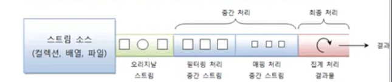
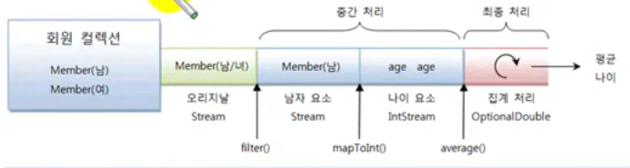
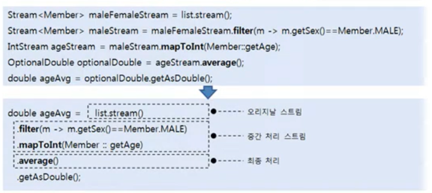

# 중간 처리와 최종 처리

스트림은 데이터의 필터링, 매핑, 정렬, 그룹필 등의 중간 처리와 함께, 평균, 카운팅 , 최대값, 최소 값 등의
최종 처리를 파이프라인으로 해결한다.

파이프라인은 여러 개의 스트림이 연결되어 있는 구조를 말한다. 파이프라인에서 최종 처리를 제외하고는 모두 중간 처리 스트림이다.

중간 스트림이 생성될 때 요소들이 바로 중간 처리(필터링, 매핑 , 정렬)되는 것이 아니라 최종 처리가 시작되기 전까지
중간 처리는 지연된ㄴ다. 최종 처리가 시작되면 비로소 컬렉션의 요소가 하나씩 중간 스트림에서 처리되고 최종 처리까지 오게 된다.

Stream 인터페이스에는 필터링, 매핑, 정렬 등의 많은 중간 처리 메소드가 있는데, 
이 메소드들은 중간 처리된 스트림을 리턴한다. 그리고 이 스트림에서 다시 중간 처리 메소드를 호출해서 파이프 라인을 형성하게 된다.
예를 들어 회원 컬렉션에서 남자만 필터링하는 중간 스트림을 연결하고, 다시 남자의 나이로 매핑하는 스트림을 연결한 후,
최종 남자 평균 나이를 집계한다면 다음 그림처럼 파이프라인이 형성된다.

