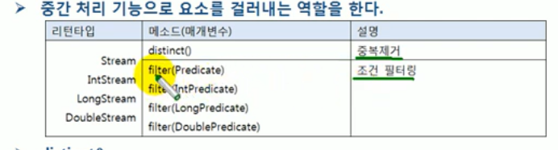
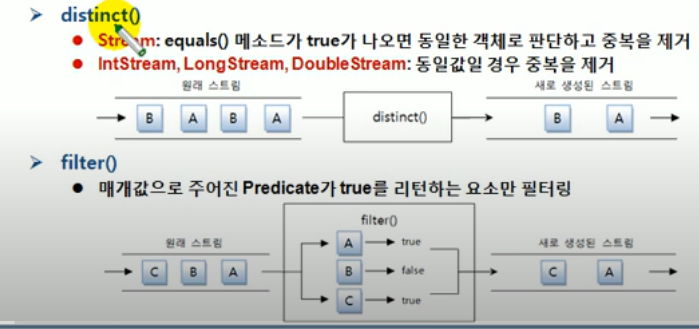

# 필터링(distinct() , filter())

필터링은 중간 처리 기능으로 요소를 걸러내는 역할을 한다.

필터링 메소드인 distinct()와 filter() 메소드는 모든 스트림이 가지고 있는 공통 메소드 이다.




- distinct()
    - 중복을 제거한다.
    - Stream의 경우 Object.equals(Object)가 true 이면 동일한 객체로 판단하고 중복을 제거한다.
    - IntStream, LongStream, DoubleStream은 동일값일 경우 중복을 제거한다.
    
- filter()
    - 매개값으루 주어진 Predicate 가 true를 리턴하는 요소만 필터링한다.



```java
public class FilteringExample {
    public static void main(String[] args) {
        List<String > names = Arrays.asList(
                "홍길동","신용권","김자바","박건희","신민철","박건희","박건오"
        );

        names.stream()
                .distinct()
                .forEach(n -> System.out.println(n));
        System.out.println();

        names.stream()
                .filter(n -> n.startsWith("신"))
                .forEach(n -> System.out.println(n));

        System.out.println();

        names.stream()
                .distinct()
                .filter(n -> n.startsWith("박"))
                .forEach(n -> System.out.println(n));
    }

```