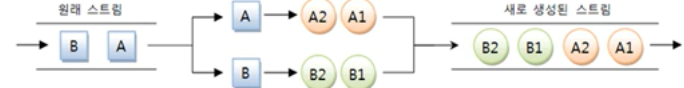
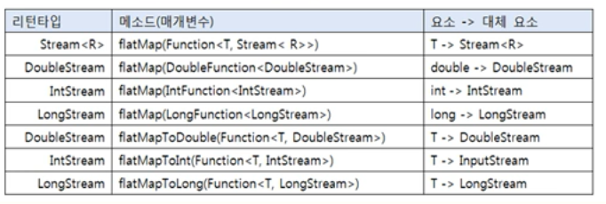

# flatMapXXX() 메소드

- flatMapXXX() 메소드는 요소를 대체하는 복수 개의 요소들로 구성된 새로운 스트림을 리턴한다.

스트림에서 A라는 요소는 A1, A2 요소로 대체되고
B라는 요소는 B1,B2로 대체 된다고 가정했을 경우,



A1,A2,B1,B2 요소를 가지는 새로운 스트림이 생성된다.


flatMapXXX() 메소드




```java
public class FlatMapExample {
    public static void main(String[] args) {
        List<String > inputList1 = Arrays.asList("java8 lambda" , "stream mapping");

        inputList1.stream()
                .flatMap(data -> Arrays.stream(data.split(" ")))
                .forEach(word -> System.out.println(word));

        System.out.println();

        List<String > inputList2 = Arrays.asList("10 ,20, 30","40,50,60");
        inputList2.stream()
                .flatMapToInt(data -> {
                    String [] strArr = data.split(",");
                    int[] intArr = new int[strArr.length];
                    for (int i=0; i< intArr.length; i++){
                        intArr[i] = Integer.parseInt(strArr[i].trim());
                    }
                    return Arrays.stream(intArr);
                })
                .forEach(number -> System.out.println(number));
    }
}

```
