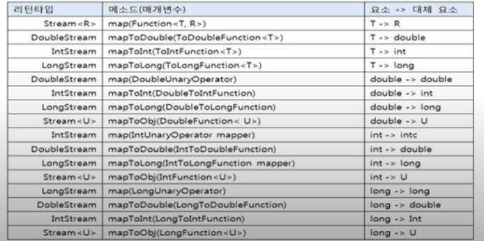

# mapXXX() 메소드

mapXXX() 메소드는 요소를 대체하는 요소로 구성된 새로운 스트림을 리턴한다.


스트림에서 A 요소는 C 요소로 대체되고, B 요소는 D 요소로 대체된다고 했을 경우, C,D 요소를 가지는 
새로운 스트림이 생성된다.


- flatMap과의  차이점은 flatMap은 요소를 복수 개의 요소로 대체 하고 Map은 한 요소를 다른 요소로 대체

mpaXXX() 메소드의 종류




```java
public class MapExample {
    public static void main(String[] args) {
        List<Student> studentList = Arrays.asList(
                new Student("홍길동", 10),
                new Student("신용권",20),
                new Student("유미선",30)
        );

        studentList.stream()
                .mapToInt(Student :: getScore)
                .forEach(score -> System.out.println(score));
    }
}
```