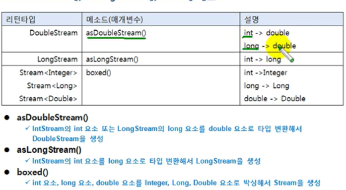

# asDoubleStream() , asLongStream() , boxed() 메소드
asDoubleStream() 메소드는 IntStream 의 int 요소 또는 LongStream의 long 요소를 double 요소로 타입 변환해서
DoubleStream 을 생성한다.

마찬가지로 asLongStream() 메소드는 IntStream의 int 요소를 long 요소로 타입 변환해서 LongStream을 생성한다.

boxed() 메소드는 int, long , double 요소를 Integer, Long , Double 요소로 박싱해서 Stream 을 생성한다.



```java
public class AsDoubleStreamAndBoxedExample {
    public static void main(String[] args) {
        int[] intArray = {1, 2, 3, 4, 5};

        IntStream intStream = Arrays.stream(intArray);
        intStream
                .asDoubleStream()
                .forEach(d -> System.out.println(d));

        System.out.println();

        intStream = Arrays.stream(intArray);

        intStream.boxed().forEach(obj -> System.out.println(obj.intValue()));
    }
```