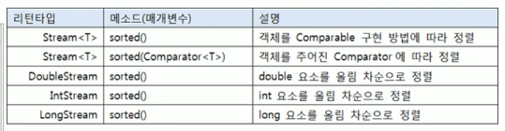

# 정렬(sorted())

스트림은 요소가 최종 처리되기 전에 중간 단계에서 요소를 정렬해서 최종 처리 순서를 변경할 수 있다.



객체 요소 일 경우에는 클래스가 Comparable을 구현하지 않으면 sorted() 메소드를 호출했을 때
ClassCastException이 발생하기 때문에 Comparable을 구현한 요소에서만 sorted() 메소드를 호출해애 한다.

`Student.java 정렬 가능한 클래스`

```java
public class Student implements Comparable<Student>{

    private String name;
    private int score;

    public Student(String name, int score) {
        this.name = name;
        this.score = score;
    }

    public String getName() {
        return name;
    }

    public int getScore() {
        return score;
    }

    @Override
    public int compareTo(Student o) {
        return Integer.compare(score, o.score);
    }
}
```

객체 요소가 Comparable을 구현한 상태에서 기본 비교(Comparable) 방법으로 정렬하고 싶다면
다음 세가지 방법 중 하나를 선택해서 sorted()를 호출하면 된다.

```java
sorted();
sorted( (a,b) -> a.compareTo(b) );
sorted( Comparator.naturalOrder());
```

만약 객체 요소가 Comparable을 구현하고 있지만, 기본 비교 방법과 정반대 방법으로 정렬하고 싶다면 다음과 같이  sorted()를 호출하면 된다.

```java
sorted( (a,b)  -> b.compareTo(a));
sorted ( Comparator.reverseOrder());
```

객체 요소가 Comparable를 구현하지 않았다면 Comparator를 매개값으로 갖는 sorted() 메소드를 사용하면 된다.

Comparator 는 함수적 인터페이스이므로 다음과 같이 람다식으로 매개값을 작성할 수 있다.

```java
sorted( (a,b) -> { ... })
```

중괄호 {} 안에는 a와 b를 비교해서 a가 작으면 음수, 같으면 0 , a가 크면 양수를 리턴하는 코드를 작성하면 된다.

```java
public class SortingExample {
    public static void main(String[] args) {
        //숫자 요소일 경우
//        IntStream intStream = Arrays.stream(new int[] {5,3,2,1,4});
        Arrays.stream(new int[] {5,3,2,1,4})
                .sorted()
                .forEach(n -> System.out.println(n + ","));
        System.out.println();


        // 객체 요소 일 경우
//        List<Student> studentList = Arrays.asList(
//                new Student("홍길동",30),
//                new Student("신용권",10),
//                new Student("유미선",20)
//        );

        Arrays.asList(
                new Student("홍길동",30),
                new Student("신용권",10),
                new Student("유미선",20)
        ).stream().sorted().forEach(s-> System.out.println(s.getScore() +","));
        System.out.println();

        Arrays.asList(
                new Student("홍길동",30),
                new Student("신용권",10),
                new Student("유미선",20)
        ).stream().sorted(Comparator.reverseOrder())
                .forEach(s -> System.out.println(s.getScore()+","));
    }
}
```