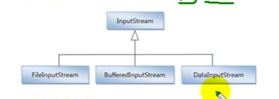
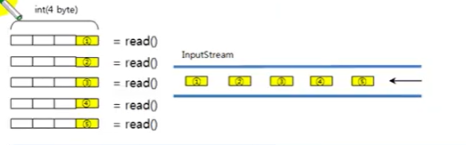

## InputStream

InputStream은 바이트 기반 입력 스트림의 최상위 클래스로 추상 클래스이다.


=> new 연산자를 이용해서 객체를 생성 할 수 없다.

```java
        new InputStream(); // 오류

```
`'InputStream' is abstract; cannot be instantiated`


모든 바이트 기반 입력 스트림은 이 클래스를 상속받아서 만들어진다.
다음과 같이 FileInputStream, BufferedInputStream, DataInputStream
클래스는 모두 InputStream 클래스를 상속하고 있다.




#### InputStream 클래스의 주요 메소드

- read() - 리턴 타입 int : 입력 스트림으로부터 1바이트를 읽고 읽은 바이트를 리턴한다.
  
4byte 인 int 끝에 read()로 읽은 1바이트가 저장된다.
- read(byte[] b) - 리턴 타입 int : 입력 스트림으로부터 읽은 바이트들을 매개값으로
주어진 바이트 배열 b에 저장하고 실제로 읽은 바이트 수를 리턴한다.
  
- read(byte[] b , int off , int len) - 리턴 타입 int :
입력 스트림으로부터 len 개의 바이트 만큼 읽고 매개값으로 주어진 바이트 배열 b[off] 부터
  len개 까지 저장한다. 그리고 실제로 읽은 바이트 수인 len개를 리턴한다.
  만약 len개를 모두 읽지 못하면 실제로 읽은 바이트 수를 리턴한다.
  
- close() - 리턴 타입 void : 사용한 시스템 자원을 반납하고 입력 스트림을 닫는다.


### read() 메소드

read() 메소드는 입력 스트림으로부터 1바이트를 읽고 4바이트 int 타입으로 리턴한다.
따라서 리턴된 4바이트 중 끝의 1바이트에만 데이터가 들어 있다. 예를 들어 입력 스트림에서
5개의 바이트가 들어온다면 다음과 같이 read() 메소드로 1바이트 씩 5번 읽을 수 있다.



더 이상 입력 스트림으로부터 바이트를 읽을 수 없다면 read() 메소드는
-1을 리턴하는데, 이것을 이용하면 읽을 수 있는 마지막 바이트까지
루프를 돌며 한 바이트씩 읽을 수 있다.
```java
InputStream is = new InputStream("C:/test.jpg");
int readByte;
while((readByte = is.read()) != -1){ ... }
```

예)
```java
InputStream is = new FileInputStream("C:\\Temp/test.txt");
int readByte;
```
test.txt 파일에 aqdsz 문자가 있다고 가정하자

```java
System.out.println(is.read());
```
1바이트를 읽기 때문에 aqdsz 중  제일 앞에 있는 1바이트 문자 a를 읽는데

read() 메소드의 리턴 값은 int이기 때문에 a의 유니코드인 97이 출력 된다.

